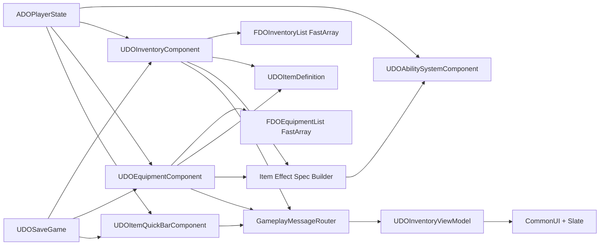
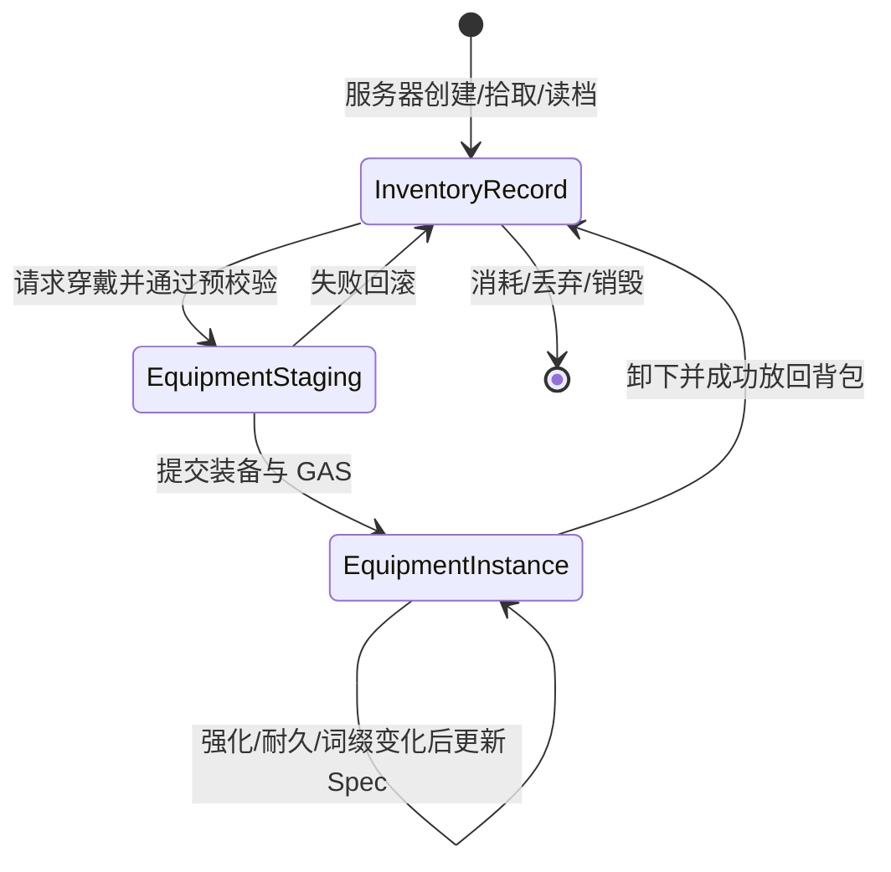
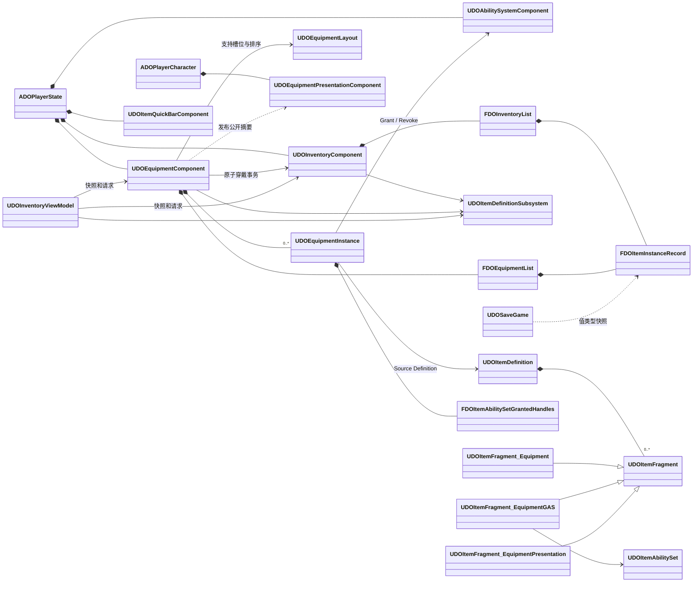
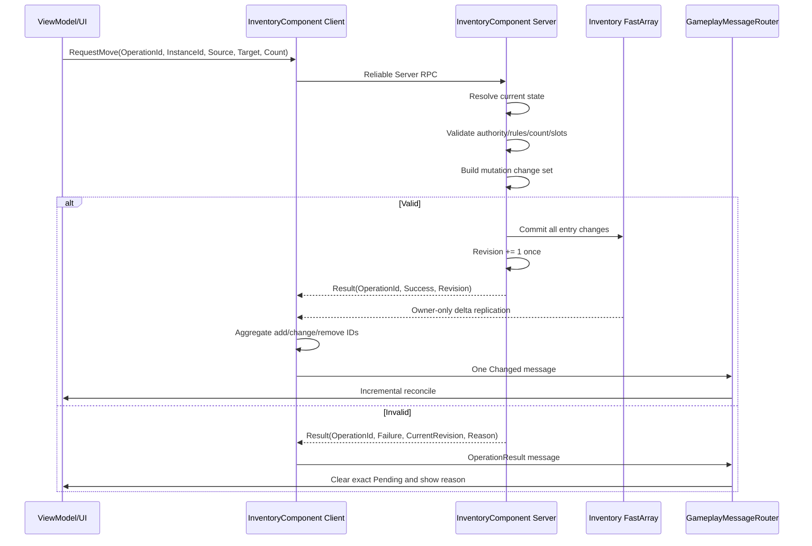
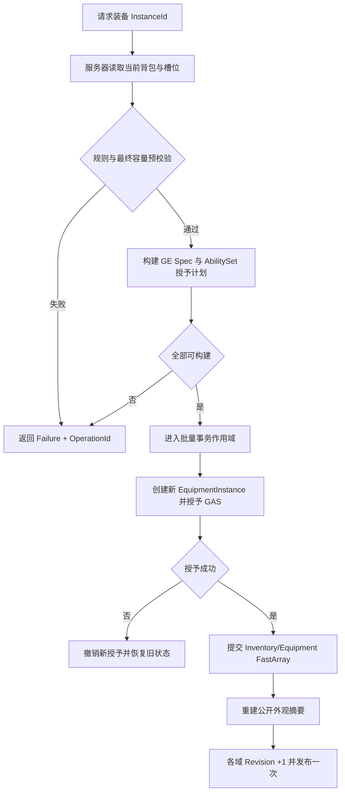
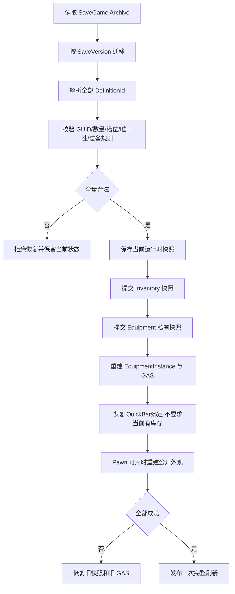
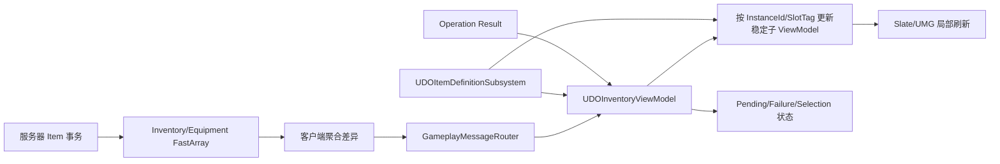

# 当前项目背包系统优化方案

> 项目：DragonOath（龙途）  
> 引擎：Unreal Engine 5.8  
> 分析日期：2026-08-05  
> 参考目录：`D:\ue_texiao\小资料\GAS_背包`  
> 文档性质：架构分析与渐进迁移方案，不包含 Demo 代码，不代表一次性重构指令

## 1. Executive Summary

DragonOath 当前物品系统的基础方向是正确的，已经具备商业项目所需的多项关键能力：

- `UPrimaryDataAsset + Instanced Fragment` 的物品静态定义。
- `FPrimaryAssetId + FGuid` 的稳定身份。
- Inventory 与 Equipment 的 Owner-only `FFastArraySerializer`。
- 服务器权威 RPC，客户端只提交操作意图，不提交最终属性和数量结果。
- C++ 原生 GameplayEffect、SetByCaller 与统一 Spec Builder。
- PlayerState 持有 ASC、Inventory、Equipment、QuickBar，符合玩家跨 Pawn 生命周期的需要。
- GameplayMessageRouter、C++ ViewModel、CommonUI/Slate、Drag Drop、Tooltip 和 Pending 状态。
- SaveGame 已有版本号、恢复前校验、跨背包/装备唯一性检查与失败回滚框架。

但本次源码复核确认了三个必须优先处理的正确性问题：

1. Inventory 和 Equipment 的 FastArray 删除回调写成了 UE 5.8 不会调用的 `PostReplicatedRemove`，纯删除操作可能不会通知客户端 UI。
2. `FDOItemInstanceRecord` 和词缀内部字段没有 `SaveGame` 标记，真实 SaveGame Archive 往返可能丢失 GUID、DefinitionId、数量、耐久和词缀；现有测试只做内存对象 Capture/Restore，没有经过真实序列化。
3. QuickBar 允许物品耗尽后保留绑定，但恢复时又要求绑定物品必须仍在背包，正常“药水用完后保存”会导致整份物品存档恢复失败并回滚。

因此，本方案不建议重写系统，也不建议照搬参考插件。目标是补齐五个边界：

1. **持久化正确性**：真实 Archive 往返、快捷栏零库存语义、版本迁移。
2. **事务边界**：一次业务操作只提交一次、递增一次 Revision、广播一次最终状态。
3. **装备运行时生命周期**：用 `UDOEquipmentInstance` 精确持有装备授予的 GE、GA 和 Tag 来源。
4. **网络协议完整性**：成功与失败都返回 `ClientOperationId + ServerRevision`，私有装备与公开外观分开复制。
5. **展示层增量更新**：统一资产解析与缓存，ViewModel 按 InstanceId/SlotTag 更新，不再每次重建整页。

最终推荐采用以下混合方案：

| 领域 | 保留 | 新增或调整 |
|---|---|---|
| 静态物品数据 | `UDOItemDefinition`、PrimaryAsset、Fragment | 统一 Definition Resolver/Cache；增加可选装备 GAS 与表现 Fragment |
| 动态物品数据 | `FDOItemInstanceRecord` | 移到 ItemSystem/Core；暂不改成 replicated UObject |
| 背包复制 | Owner-only FastArray | 修正删除回调、聚合变化、事务 Revision、显式操作结果 |
| 装备复制 | Owner-only FastArray | 增加服务器侧 `UDOEquipmentInstance`；Pawn 上增加公开外观摘要 |
| GAS | 原生 GE + SetByCaller + Spec Builder | 增加 Item AbilitySet、来源化授予句柄、精确撤销 |
| UI | GameplayMessageRouter + C++ ViewModel + CommonUI/Slate | 稳定子 ViewModel、集中资产解析、按差异刷新 |
| 存档 | 版本化 SaveGame + 快照回滚 | 修正嵌套字段序列化；运行时对象和 GAS Handle 永不入档 |

### 1.1 明确不做的重构

- 不引入 GameItemsPlugin 的完整 ContainerGraph、任意 Rule/Link 图和全功能容器框架。
- 不在当前阶段把每个物品改成 replicated `UDOItemInstance`。
- 不为单件装备动态创建或移除 AttributeSet。
- 不允许客户端预测物品数量、装备结果、消耗品效果或 GAS 属性。
- 不新增全局权威 `InventoryManager` 单例。
- 不替换现有 GameplayMessageRouter、CommonUI、Slate 或 C++ ViewModel 技术栈。
- 不保存 GameplayEffectSpec、ActiveGameplayEffectHandle、AbilitySpecHandle 或 EquipmentInstance。

## 2. 分析范围与参考工程构成

`D:\ue_texiao\小资料\GAS_背包` 实际包含三套定位不同、互相补充的工程，而不是一套可以直接迁移的完整背包：

| 工程 | 主要价值 | 主要局限 |
|---|---|---|
| `InventorySystems-main` | 空间格背包、Fragment、FastArray、原生 UMG、拖放、Tooltip、装备表现 | 教程型实现；没有真实 GAS 和存档；客户端/UI 越过权威边界 |
| `GameItemsPlugin-main` | 通用 Item/Container/Rule/Link、replicated UObject、预测、装备、MVVM、SaveData | 框架能力很强，但对当前项目明显过重，且预测与跨端传物存在安全和事务缺口 |
| `ExtendedGameplayAbilitiesPlugin-main` | AbilitySet 聚合、来源对象、授予 Handle、精确回收 | 只解决 GAS 授予；调用方仍需正确聚合 Handle 和管理共享 AttributeSet |

本次同时审计 DragonOath 的以下区域：

- `Source/DragonOath/ItemSystem/Core`
- `Source/DragonOath/ItemSystem/Inventory`
- `Source/DragonOath/ItemSystem/Equipment`
- `Source/DragonOath/ItemSystem/Usage`
- `Source/DragonOath/ItemSystem/QuickBar`
- `Source/DragonOath/ItemSystem/Pickup`
- `Source/DragonOath/ItemSystem/AbilitySystem`
- `Source/DragonOath/ItemSystem/Tests`
- `Source/DragonOath/AbilitySystem`
- `Source/DragonOath/UI/Inventory`
- `Source/DragonOath/SaveGame`
- `Source/DragonOath/Player`
- `Config/DefaultGame.ini`

## 3. 参考项目学习总结

## 3.1 InventorySystems-main

### 3.1.1 背包整体架构

代表文件：

- `Plugins/Inventory/Source/Inventory/Public/Items/Manifest/Inv_ItemManifest.h`
- `Plugins/Inventory/Source/Inventory/Public/Items/Fragments/Inv_ItemFragment.h`
- `Plugins/Inventory/Source/Inventory/Public/Items/Inv_InventoryItem.h`
- `Plugins/Inventory/Source/Inventory/Public/InventoryManagement/FastArray/Inv_FastArray.h`
- `Plugins/Inventory/Source/Inventory/Public/InventoryManagement/Components/Inv_InventoryComponent.h`

其核心模型是：

```text
Item Manifest
  -> TInstancedStruct<Item Fragment>
  -> UInv_InventoryItem 运行时 UObject
  -> FastArray 保存 Item UObject 引用
  -> registered subobject replication
  -> InventoryComponent 管理增删和 RPC
```

`FInv_ItemManifest` 通过 `TArray<TInstancedStruct<FInv_ItemFragment>>` 组合 Grid、Image、Stackable、Consumable、Equipment 等能力。世界物品由 `UInv_ItemComponent` 持有 Manifest；拾取时 FastArray 调用 Manifest 创建 `UInv_InventoryItem`。

可借鉴之处：

- Fragment 组合可以避免 WeaponItem、ArmorItem、PotionItem 子类爆炸。
- Item UObject 能为装备 Actor、UI 和运行时行为提供稳定引用。
- 空间格算法拆分出了 GridSlot、SlottedItem、HoverItem 等明确概念。

不应直接复制之处：

- `UInv_InventoryItem` 复制并同步整份 Manifest，静态图标、尺寸、类型与 StackCount、bEquipped 等运行态混在一起。
- `Manifest()` 创建实例后会清空来源 Fragments，属于破坏性 move 语义，不能作为共享静态定义。
- DragonOath 当前实例状态较轻，改成 replicated UObject 会增加 Subobject 注册、Outer、销毁、NetGUID 和存档复杂度，收益不足。

### 3.1.2 UObject、Actor、Struct 职责与生命周期

- Struct Manifest/Fragment 同时承载静态配置和部分动态状态。
- `UInv_InventoryItem` 是库存中的运行时对象。
- EquipActor 是世界表现 Actor。
- InventoryComponent 创建 Item 并将其注册为复制子对象。
- FastArray 条目保存 Item UObject 指针。

其 Subobject 生命周期并不完全对称：新增和删除路径的注册/注销覆盖不一致，已有 Item 加入时也存在未注册风险。这说明 replicated UObject 方案必须把“创建、注册、复制、移除注册、销毁”作为完整协议，不能只复制一个指针。

### 3.1.3 数据持久化

全项目没有形成可迁移的 SaveGame/持久化实现，没有版本迁移、GUID 去重、跨背包/装备一致性校验和失败回滚。因此该项目不能作为 DragonOath 存档基线。

### 3.1.4 GAS 结合

该工程没有真实 GameplayAbility、GameplayEffect、AttributeSet 接入。装备流程主要是：

- InventoryComponent 用 Multicast 广播装备/卸下。
- EquipmentComponent 监听后执行 Fragment Modifier。
- Spawn/Destroy EquipActor。
- Modifier 当前主要输出调试信息，源码注释才建议未来接 ASC/GE。

因此它只能提供装备表现和交互参考，不能提供 GAS 装备架构。

### 3.1.5 数据驱动

Manifest + InstancedStruct Fragment 的组合思想值得吸收，但 DragonOath 已有更适合当前项目的 `UPrimaryDataAsset + UObject Fragment`，没有必要更换资产身份模型。

### 3.1.6 网络同步

该工程使用 FastArray 和 registered subobject replication，但存在严重权威边界问题：

- 服务器添加物品会调用 Inventory UI 的 `HasRoomForItem`，领域规则依赖 UMG；Dedicated Server 或远端玩家的服务端 Controller 可能没有该 Widget。
- AddNew/AddStacks RPC 接受客户端计算的 StackCount/Remainder。
- Drop/Consume/Equip 的归属、数量和槽位验证不足。
- “预测”实质是 UI 先改数量再发 RPC，没有 PredictionKey、拒绝回滚和服务器确认。
- 装备状态依赖瞬时 Multicast，不是可恢复的 replicated state，Late Join 和 relevancy 重入无法可靠重建。

DragonOath 应保留“客户端只传意图，服务器重新计算全部结果”的现有方向。

### 3.1.7 UI 架构

代表文件：

- `Widgets/Inventory/Spatial/Inv_InventoryGrid.*`
- `Widgets/Inventory/HoverItem/Inv_HoverItem.*`
- `Widgets/Inventory/SlottedItems/Inv_SlottedItem.*`
- `Widgets/ItemDescription/Inv_ItemDescription.*`
- `Widgets/Composite/Inv_Composite.*`

优点：

- 支持多格占用、旋转/落位、分堆、装备栏和悬浮描述。
- Tooltip 采用 Composite/Leaf，并由 Fragment `Assimilate` 投影展示内容，适合不同物品组合说明项。

局限：

- 近千行 InventoryGrid 同时做布局、占用算法、鼠标状态、数据修改和 RPC。
- 不属于严格 MVC/MVVM，UI 维护大量镜像状态。
- 拖动是 HoverItem 每 Tick 追踪鼠标的手工方案，不是标准 `UDragDropOperation`。
- Tooltip 延时回调捕获 Item/Manifest 引用，Item 提前销毁时存在悬垂风险。

DragonOath 只应借鉴交互和“Fragment 驱动展示投影”，不能让 Widget 持有权威规则。

## 3.2 GameItemsPlugin-main

### 3.2.1 定义、实例和容器

代表文件：

- `Plugins/GameItems/Source/GameItems/Public/GameItemDef.h`
- `Plugins/GameItems/Source/GameItems/Public/GameItemFragment.h`
- `Plugins/GameItems/Source/GameItems/Public/GameItem.h`
- `Plugins/GameItems/Source/GameItems/Public/GameItemContainer.h`
- `Plugins/GameItems/Source/GameItems/Public/GameItemContainerGraph.h`
- `Plugins/GameItems/Source/GameItems/Public/Rules/GameItemContainerRule.h`
- `Plugins/GameItems/Source/GameItems/Public/Rules/GameItemContainerLink.h`

其抽象层次为：

```text
GameItemDef Blueprint Class/CDO + Instanced Fragment
  -> UGameItem replicated UObject
  -> UGameItemContainer
  -> Container Rule / Link
  -> ContainerGraph
  -> Component 负责子对象复制和操作路由
```

`UGameItemDef` 不是 PrimaryDataAsset，而是 Blueprintable UObject 类定义，通过 CDO 使用。`UGameItem` 只保留 Def Class、Count、动态 TagStats、GUID 和预测状态，静态与动态分离比 InventorySystems-main 清晰。

### 3.2.2 UObject、Actor、Struct 职责

- Def/Fragment：静态规则和可复用能力。
- UGameItem：动态实例、多态状态和预测状态。
- UGameItemContainer：背包、装备槽、快捷栏等通用容器聚合根。
- Rule/Link：容量、Tag 要求、自动槽位、父子/选择关系。
- Equipment UObject：穿戴期间运行时状态。
- Equipment Actor：武器和服装等世界表现。
- Struct/FastArray：Slot->Item 列表、TagStats、预测键和 SaveData。

Item/Container/Rule 都显式注册和注销 replicated subobject，生命周期边界明显比教程工程成熟。

### 3.2.3 容器与规则设计

优点：

- 一个 Container 抽象可以表达背包、单槽装备、快捷栏。
- Instanced Rule 负责 CanContain、总量、堆叠上限和 Tag 要求。
- Parent/Selection/AutoSlot Link 将装备槽和快捷栏表达为容器关系。
- FastArray 使用接收结束聚合通知，避免逐项刷新抖动。

局限：

- 对 DragonOath 当前三个明确组件而言，完整 ContainerGraph、任意 Link 和可复制 Rule 过重。
- 容器框架越通用，权限、事务和调试面越大。

DragonOath 可以吸收“策略与容器分离”思想，但暂不引入通用容器图。

### 3.2.4 Item 生命周期与持久化

`UGameItemSubsystem::CreateItem` 集中创建 Item，设置 Def/Count，再依次调用 Fragment 的 `OnItemCreated`。SaveData 使用：

- GUID 去重共享 Item。
- SoftClass ItemDef。
- `SaveGame` 属性 ByteData。
- Container Slot Map。
- Rule/Container ByteData。

优点是可保存不同 Item 子类扩展字段；风险是：

- 没有完整显式 Schema Version/Migration。
- SoftClass 重命名风险。
- 读取使用同步加载。
- 二进制属性序列化对类演进要求高。

DragonOath 当前值类型记录更简单、可审计。可以吸收 GUID、领域快照和版本迁移思想，不需要复制其 UObject 字节存档。

### 3.2.5 GAS 结合

`GameplayAbilityItems` 提供 Usage Ability 与 Ability Equipment：

- Item Fragment 可以按 Tag/Class 激活预先授予的使用 Ability。
- Equipment runtime UObject 在穿戴期间向 ASC 授予能力和效果。
- AbilitySpec 与 EffectContext SourceObject 指向 Equipment。
- 卸下时按 Handle 撤销。

最值得迁移的闭环是：

1. 穿戴时创建独立 Equipment runtime object。
2. 以该对象作为 GA/GE SourceObject。
3. 保存所有授予 Handle。
4. 卸下时只撤销该来源内容。

### 3.2.6 数据驱动

- 主物品定义使用 Definition + Fragment，不用一张巨型 DataTable。
- ContainerDef、EquipmentDef、Fragment 等资产化。
- DataTable 主要用于 DropTable、权重和批量规则。

这一点与 DragonOath 当前 PrimaryDataAsset 方向一致：物品主定义继续使用 DataAsset，DataTable 只用于掉落、强化曲线、词缀权重、品质曲线等天然表格化数据。

### 3.2.7 网络同步与预测

该工程提供 LocalOnly、LocalPredicted、ServerInitiated、PredictionKey 和 Pending remove/move/count。

可借鉴：

- 命令 + PredictionKey/OperationId。
- Pending 状态。
- 服务器接受/拒绝后的对账。
- FastArray 与 Item 内部状态分层。

不可直接采用：

- Reject/Pending UI 事件仍有未完成 TODO。
- 目标槽 Pending Add 未完成。
- 跨端 Move 有字段赋值错误。
- `ServerReceiveItems` 可以接受客户端序列化的 Def/Count/TagStats 并在服务器重建，缺乏来源和白名单校验，存在伪造物品风险。
- 批量 Move 中途失败没有回滚已成功的前项，不是原子事务。
- 容器是否属于 RPC 发起者、玩家是否有访问权限的验证不足。
- `IsMatching` 只比较 ItemDef，不比较耐久、绑定、词缀等动态状态，可能错误堆叠。

因此 DragonOath 只迁移“操作键 + Pending + 权威对账”思想，不迁移其跨端传物和预测实现。

### 3.2.8 UI 架构

代表文件：

- `Plugins/GameItemsUI/Source/GameItemsUI/Public/ViewModels/VM_GameItem.h`
- `VM_GameItemContainer.h`
- `VM_GameItemSlot.h`
- `GameItemViewModelResolver.h`
- `GameItemsUISubsystem.h`

其 UI 使用 `UMVVMViewModelBase`、Field Notify、LocalPlayerSubsystem 和命令路由：

- Widget 不直接修改 Container。
- Item/Slot/Container VM 可复用。
- 单个属性变化可以局部刷新。
- LocalPlayerSubsystem 缓存 VM，并把命令路由到 PlayerController Component。

不足：

- C++ 插件本身没有完整 DragDrop/Tooltip 实现，主要提供 VM 和 move/swap/stack 命令。
- Item VM 对动态 TagStats 的新增/删除通知仍不完整。

DragonOath 已有 C++ ViewModel 和 GameplayMessageRouter，无需启用另一套框架；应吸收稳定子 ViewModel、集中 Resolver 和增量通知。

## 3.3 ExtendedGameplayAbilitiesPlugin-main

### 3.3.1 AbilitySet 结构

代表文件：

- `Plugins/ExtendedGameplayAbilities/Source/ExtendedGameplayAbilities/Public/ExtendedAbilitySet.h`
- `Plugins/ExtendedGameplayAbilities/Source/ExtendedGameplayAbilities/Private/ExtendedAbilitySet.cpp`
- `ExtendedAbilitySystemStatics.*`

`UExtendedAbilitySet` 可聚合：

- GameplayAbility。
- GameplayEffect。
- AttributeSet。

授予时返回 `FExtendedAbilitySetHandles`，保存 AbilitySpecHandle、ActiveGameplayEffectHandle 和 AttributeSet 信息；卸载时按 Handle 精确移除。

### 3.3.2 完整装备-GAS 链

参考链路为：

```text
GameItemFragment_Equipment
  -> WorldCondition 判断是否生效
  -> GameItemEquipmentComponent 监听 slot/add/remove
  -> GameEquipmentComponent 创建 replicated Equipment UObject
  -> UAbilityEquipment 在服务器授予多个 AbilitySet
  -> AbilitySpec / EffectContext SourceObject = Equipment
  -> 卸下按 Handle 移除
```

可迁移思想：

- 授予结果必须是可聚合、可撤销的 Handle 集。
- 授予和移除只在服务器执行。
- SourceObject 使用 EquipmentInstance。
- InputTag 可以写入 AbilitySpec Dynamic Tags。
- 使用型 Item Fragment 只激活预先授予的 Ability，不负责临时构造任意能力。

### 3.3.3 必须规避的缺陷

- `UAbilityEquipment::GiveAbilitySets` 循环中覆盖单个 Handle 结果；多个 AbilitySet 时只保留最后一组，前面能力/GE 会泄漏。DragonOath 必须 Append 到数组或聚合 Handle。
- 动态 AttributeSet 只有“是否已存在”判断，没有来源引用计数；先授予者卸下可能删除仍被其他装备使用的 AttributeSet。
- Base Equipment RPC 可以直接接受 EquipmentDef/Spec，服务器对客户端配置输入信任过多。
- 某些映射以 EquipmentDef 为键而不是 ItemInstanceId；同 Definition 多实例时可能移除错误来源。

DragonOath 应保持 Health/Resource/Combat AttributeSet 固定，只迁移 GA/GE Handle 和 SourceObject 模式。

### 3.3.4 DragonOath 中 AbilitySet 的取舍

DragonOath 现有 `UDOAbilitySet` 是职业技能配置，包含 AbilityId、最大等级、输入/事件绑定和 0 级未学习机制，并由 ASC 的职业技能升级映射管理。

直接把装备临时技能、被动 GE 和动态 AttributeSet 塞入该类，会混淆职业技能升级语义。因此本方案选择：

- 现有 `UDOAbilitySet` 继续服务职业技能。
- 新增 `UDOItemAbilitySet` 服务装备和物品来源。
- 二者可复用底层来源化 Handle 结构和 ASC 辅助函数。
- 装备临时 Ability 不写入职业 `AbilityIdToSpecHandle` 和最大等级映射。

## 3.4 参考方案吸收矩阵

| 参考思想 | 结论 | DragonOath 落地方式 |
|---|---|---|
| Fragment 组合 | 吸收 | 保留 `UDOItemDefinition + UDOItemFragment` |
| 运行时 Item UObject | 条件吸收 | 当前保留 Struct；复杂实例行为出现后再引入非权威 Facade |
| Equipment runtime UObject | 吸收 | 新增服务器侧 `UDOEquipmentInstance` |
| FastArray | 吸收并修正 | 保留 Struct FastArray，修正删除回调、聚合和 Revision |
| replicated UObject subobject | 暂不采用 | 当前数据规模不值得增加生命周期复杂度 |
| ContainerGraph / 任意 Rule-Link | 不采用 | 当前由 Inventory、Equipment、QuickBar 三个明确组件负责 |
| AbilitySet Handle | 吸收 | 新增 Item AbilitySet 与聚合授予 Handle |
| 动态 AttributeSet | 不采用 | 核心 AttributeSet 固定；装备使用 GE |
| LocalPredicted Inventory | 暂不采用 | 只做 Pending；未来只评估纯槽位移动 |
| MVVM 细粒度模型 | 吸收 | 保留现有技术栈，增加稳定 Item/Slot/Tooltip ViewModel |
| UI 参与容量/堆叠计算 | 不采用 | UI 只发意图，服务器重新计算 |
| DataTable 作为物品主表 | 不采用 | 主定义继续使用 PrimaryDataAsset |
| DataTable 用于批量数值 | 吸收 | 掉落、词缀、强化、品质曲线使用表格数据 |

## 4. DragonOath 当前架构分析

## 4.1 当前运行时关系



### 4.1.1 静态数据

`UDOItemDefinition : UPrimaryDataAsset` 保存名称、描述、图标、ItemType、Rarity、Tags、MaxStackSize、SortPriority、价格和 Instanced Fragment。

现有主要 Fragment：

- `UDOItemFragment_Inventory`：库存规则、唯一性等。
- `UDOItemFragment_Equipment`：槽位、需求、耐久和类型化属性。
- `UDOItemFragment_Consumable`：即时回复、限时属性、GameplayAbility、GameplayEvent 和冷却。

`Config/DefaultGame.ini` 已将 `ItemDefinition` 扫描到 `/Game/DragonOath/Items/Definitions`，并使用 AlwaysCook。

### 4.1.2 动态数据

`FDOItemInstanceRecord` 当前保存：

- `FGuid InstanceId`。
- `FPrimaryAssetId DefinitionId`。
- `StackCount`。
- `SlotIndex`。
- `UpgradeLevel`。
- `CurrentDurability`。
- Affix rolls。

Inventory 与 Equipment 均包装该记录并通过 FastArray 复制。该结构对当前功能足够轻量，也是合理的网络值类型载体。

### 4.1.3 InventoryComponent

`UDOInventoryComponent.cpp` 约 1357 行，已经实现：

- 添加与自动堆叠。
- 消耗、按 Definition 消耗。
- 移动、交换、合并、拆分。
- 整理与排序。
- 丢弃。
- 消耗品直接 GE、复杂 Ability/Event。
- 快照校验与恢复。
- RPC、FastArray 回调和消息广播。

功能闭环完整，但容器算法、GAS 使用、资产解析、网络协议和 UI 消息都集中在一个实现文件中。

### 4.1.4 EquipmentComponent

`UDOEquipmentComponent` 负责：

- 装备需求和槽位校验。
- 从 Inventory 取出物品。
- 替换旧装备并将旧装备放回 Inventory。
- 失败回滚。
- 构建并应用装备属性 GE。
- 以 `TMap<SlotTag, ActiveGameplayEffectHandle>` 保存当前装备效果。
- Owner-only FastArray 和 UI 消息。

当前装备生命周期被压缩在 Component 和 SlotTag Map 中，没有独立 EquipmentInstance；装备 GE 的 SourceObject 也是共享 EquipmentComponent，而不是具体装备实例。

### 4.1.5 GAS 与 AttributeSet

当前已有：

- `UDOEquipmentAttributeEffect`：Infinite。
- `UDOItemInstantRestoreEffect`：Instant。
- `UDOItemTimedAttributeEffect`：HasDuration。
- `UDOItemCooldownEffect`：HasDuration。
- `FDOItemEffectSpecBuilder`：类型化数据转 Spec，并写入 SetByCaller。
- `DOHealthSet`、`DOResourceSet`、`DOCombatSet`：固定 AttributeSet 和复制/Clamp。
- 简单道具走 GE，复杂道具走 `UDOGameplayAbility_UseItem` 或 GameplayEvent。

这是当前系统最成熟的部分之一。装备属性不直接调用 AttributeSet Setter，而是通过 GAS 聚合，方向正确。

### 4.1.6 QuickBar 与 Pickup

- QuickBar Owner-only 复制 4 个 DefinitionId，而不是易失的 InstanceId。
- 使用时由服务器在 Inventory 中按 Definition 查找并消费。
- Pickup Actor 复制 DefinitionId 与剩余数量。
- Pickup 不在自身接收客户端 RPC，而是通过拥有连接的 PlayerController 转发。
- 服务器重新校验距离并调用 `TryAddItem`，背包不足时保留剩余数量。

这些设计符合服务器权威和生命周期边界。

### 4.1.7 UI

`UDOInventoryViewModel` 监听 Inventory、Equipment、QuickBar 的 GameplayMessage，构建页面快照，维护筛选、分页、选中项和 Pending 操作。

`DOInventorySlateWidgets` 提供格子、装备比较、Tooltip、拖放和操作控件。`UDOInventoryScreen` 接入 CommonUI。

当前已经是“领域组件 -> 消息 -> ViewModel -> Widget”的正确方向，不需要改用另一套 UI 框架。项目已有部分异步图标能力，但 Definition 解析、Tooltip 和排序等路径仍存在同步 `TryLoad`。

### 4.1.8 SaveGame

`UDOSaveGame` 当前具有：

- `CurrentSaveVersion = 1`。
- Inventory、Equipment、QuickBar 快照。
- ProfessionTag。
- 恢复前 Definition、唯一性、槽位、数量和 GUID 校验。
- 保存前状态快照。
- 任一组件恢复失败后的整体回滚。

但当前自动化测试只在同一内存中的 SaveGame UObject 上 Capture/Restore，没有调用 `SaveGameToMemory/LoadGameFromMemory` 或真实 Slot 往返。由于实例记录内部字段缺少 `SaveGame` 标记，框架设计虽合理，磁盘序列化闭环目前不能视为已完成。

## 4.2 当前架构优点

1. **静态和动态数据已经分离**  
   Definition 不随每个实例复制，实例只保存必要动态字段，优于参考教程的 Manifest 整体复制。

2. **身份稳定**  
   Definition 使用 PrimaryAssetId，实例使用 GUID，适合跨容器移动、存档和未来后端。

3. **服务器权威边界正确**  
   客户端 RPC 提交 InstanceId、槽位、数量等意图；服务器重新解析 Definition 和计算结果。

4. **FastArray 使用方向正确**  
   私有库存和完整装备只复制给 Owner，避免把词缀、耐久和数量暴露给其他客户端。

5. **装备事务已有预校验和回滚意识**  
   替换失败时尝试恢复旧装备和旧 GE，不是简单的“先删后加”。

6. **GAS 数据转换集中**  
   Item 数据不直接修改 ASC；Spec Builder 集中维护 Attribute 与 SetByCaller Tag 的映射。

7. **简单和复杂道具分流合理**  
   简单同步效果使用 GE；需要动画、目标和异步流程时使用 GA/Event。

8. **PlayerState 所有权合理**  
   ASC、Inventory、Equipment、QuickBar 跨 Pawn 重生保留，符合联机 RPG。

9. **UI 与领域层已初步解耦**  
   Widget 不直接写 FastArray，GameplayMessageRouter 作为本地消息总线。

10. **已有测试和恢复回滚基础**  
    已覆盖堆叠、移动、拆分、装备、内存快照和 DataAsset 校验，可作为下一步扩展基础。

## 4.3 当前缺陷与风险

| 等级 | 问题 | 当前影响 | 扩展后影响 |
|---|---|---|---|
| P0 | FastArray 删除回调名称错误 | 纯删除 Delta 不广播 UI 变化 | 丢弃/耗尽后 UI、快捷栏和 Pending 陈旧 |
| P0 | 实例内部字段未标 SaveGame | 真实序列化后字段可能变默认值 | 存档无法恢复或数据丢失 |
| P0 | QuickBar 零库存绑定与恢复规则冲突 | 药水耗尽后保存可导致整份恢复回滚 | 高频正常玩家路径不可用 |
| P1 | Revision 在多处重复递增 | 一次操作产生多个无明确语义版本 | 无法可靠网络对账和审计 |
| P1 | 成功 RPC 不返回 OperationId | Pending 依赖“任意变化消息”清理 | 并发、No-op、Ability 取消会挂起 |
| P1 | 装备事务发布中间状态且回滚结果被忽略 | 数据和 GAS 可能短暂或最终不一致 | 更多副作用后难以证明原子性 |
| P1 | 装备只管理属性 GE Handle | 无法统一管理主动技能、被动、Tag 和技能修改 | 多类型装备难以安全卸载 |
| P1 | 没有公开装备外观复制层 | 远端无稳定武器/服装摘要 | 联机角色表现不完整 |
| P1 | 缺少真实网络与磁盘存档测试 | 单机瞬态测试无法发现关键问题 | 延迟、丢包、归档和重连风险高 |
| P1 | 多处同步 `TryLoad` | 游戏线程可能同步 IO | 物品量增加后卡顿和重复解析 |
| P1 | Typed 属性与 Tooltip/测试仍有旧字段分叉 | 实际生效与显示可能不一致 | 资产迁移长期形成双真相 |
| P1 | Affix、耐久、绑定尚未进入完整权威/GAS流程 | 当前多为显示和校验 | 强化、损坏、交易规则无法闭环 |
| P2 | InventoryComponent 职责过多 | 1357 行实现难以局部验证 | 仓库、交易、强化加入后维护成本高 |
| P2 | 排序依赖 Tag 字符串和硬编码槽位 | `SortPriority` 未充分使用 | 新品质、新类型、新槽位需要改 C++ |
| P2 | 装备槽硬编码九个 | 不支持双戒指、主副手、弹药等 | 多职业装备布局受限 |
| P2 | ViewModel 变化时重建大快照 | 当前容量下可用 | 大容量和复杂词缀浪费明显 |
| P2 | Save Slot 依赖匹配内 PlayerId，EndPlay 自动保存 | 不是真正账号身份 | Dedicated Server/切图/断线风险 |
| P2 | CombatSet 多数属性 `COND_None` | 全客户端可见且带宽增加 | 需要重新审计公开战斗信息边界 |

### 4.3.1 FastArray 删除回调是实际功能缺陷

当前 Inventory/Equipment 声明和实现的是 `PostReplicatedRemove`。UE 5.8 FastArray 模板调用的是 `PreReplicatedRemove`，因此当前函数不会参与复制回调。

影响：

- 丢弃最后一件物品。
- 消耗最后一个堆叠。
- 卸下/删除形成纯 Remove Delta。

客户端数组本身可能被复制更新，但 GameplayMessage 不会发送，Revision 又没有 OnRep 兜底，UI 和 Pending 会保持陈旧。

目标方案：

- 使用 `PreReplicatedRemove` 在元素仍可访问时缓存 ID/SlotTag。
- Add/Change/Remove 均只累积差异。
- 在 `PostReplicatedReceive` 或 UE 5.8 对应接收完成钩子一次 Flush。

### 4.3.2 SaveGame 真实序列化缺失

外层 SaveGame 属性虽然标记正确，但 `FDOItemInstanceRecord`、`FDOItemAffixRoll` 内部字段没有 `SaveGame` 标记。SaveGame Archive 会跳过没有 `CPF_SaveGame` 的嵌套属性。

目标方案：

- Phase 1 立即修正实例和词缀所有需要持久化字段。
- 增加 `SaveGameToMemory -> LoadGameFromMemory` 测试。
- 再增加真实 Slot 往返测试。
- 保存后重新创建 SaveGame UObject，禁止测试复用原内存对象。

### 4.3.3 QuickBar 零库存语义

当前建议采用“保留绑定”语义：

- 药水数量为 0 时 QuickBar 仍保存 DefinitionId。
- UI 显示 0 和不可用状态。
- 使用请求返回 ItemNotFound/OutOfStock。
- 重新获得同 Definition 后槽位自动恢复可用。
- 恢复 QuickBar 只验证 Definition 是合法 Consumable，不要求当前库存存在。

这样既符合常见快捷栏体验，也不会因一个空槽绑定拒绝整份存档。若项目未来选择“耗尽自动清空”，也必须在消耗和丢弃路径统一执行，不能让保存和恢复采用不同规则。

### 4.3.4 Revision 语义不可靠

当前 Inventory 中：

- `MarkEntryDirty` 会递增 Revision。
- 新增/删除数组时又递增 Revision。
- `BroadcastChanged` 再递增 Revision。
- 客户端 FastArray 回调调用 `BroadcastChanged`，也会本地递增 Revision。

Equipment 的 `BroadcastChanged` 同样递增 Revision。

目标语义应为：

> Revision 只在服务器完成一次已提交事务后递增一次。客户端只接收和观察 Revision，绝不自行递增。

本地 UI 如果需要通知序号，应使用独立的 LocalChangeSerial，不能复用权威 Revision。

### 4.3.5 Pending 操作不能精确闭环

当前成功路径依赖 Changed 消息，并调用 `ClearPendingOperationsForDomain`：

- 任意一个 Inventory 变化会清除全部 Inventory Pending。
- 移动到原槽、已经有序的 Sort、重复 QuickBar 绑定不会产生 Delta，Pending 永久保留。
- 复杂 Item Ability 未 Commit、取消或失败时也没有完整结果。

目标协议必须让 Success、Failure、No-op、Cancel、Timeout 都能关联同一个 ClientOperationId。

### 4.3.6 装备事务不是完整原子事务

当前流程会依次移除旧 GE、应用新 GE、修改 Inventory、插回旧装备，并在子步骤中广播。部分回滚调用结果未检查。

扩展主动 GA、被动、Tag、外观后，平行 Map 和回滚分支会快速增加。目标应显式采用 Prepare -> Validate -> Commit -> Rollback，并在 Commit 完成前抑制外部通知。

### 4.3.7 同步资产解析分散

Inventory、Equipment、QuickBar、ViewModel、Slate Tooltip、SaveGame 和排序比较器都有 Definition 解析或 `TryLoad`。排序比较器反复解析尤其不必要。

问题不是使用 PrimaryAssetId，而是缺少统一解析、缓存、预加载和失败策略。

### 4.3.8 GAS 融合仍不完整

当前只覆盖“装备 -> 类型化属性 GE”，尚缺：

- 装备授予主动 GameplayAbility。
- 装备授予常驻被动 GameplayAbility。
- 装备授予额外 GameplayEffect。
- 装备授予可追踪来源的 GameplayTag。
- 装备对已有技能的条件修改。
- 多个 AbilitySet 的 Handle 聚合。
- 卸下时取消正在运行的装备来源 Ability。
- Affix 和损坏状态对最终 Spec 的参与。

### 4.3.9 后续维护成本

如果直接在当前 Component 中继续叠加仓库、强化、宝石、交易和套装：

- 每个新功能都需要理解 1300 行以上 Inventory 实现。
- 资产加载、事务、复制和 UI 通知会继续重复。
- 装备 GAS 句柄会从一个 Map 扩展成多个平行 Map。
- 一次跨容器失败的回滚路径会越来越难证明完整。

维护成本的核心来源不是类数量少，而是事务、生命周期和展示边界没有成为显式概念。

### 4.3.10 潜在扩展问题

- 单个精确 EquipmentSlotTag 和固定九槽无法覆盖双戒指、主副手与职业动态槽。
- Affix、宝石、绑定、锁定和损坏若继续平铺进实例记录，会扩大复制和每次比较成本。
- 仓库、交易、邮件加入后，InventoryComponent 内部方法不能直接承担跨玩家原子事务。
- 套装、装备技能和被动若继续使用平行 Handle Map，来源移除和回滚会失控。
- Definition 重命名、堆叠上限变化和资产删除缺少逐版本修复策略。
- 大容量背包继续全页快照重建，会放大同步加载和 Tooltip 比较开销。

### 4.3.11 网络同步问题汇总

- FastArray 纯删除没有正确回调。
- Revision 由服务器和客户端共同递增，不能代表权威事务版本。
- 成功/No-op/Cancel 没有统一回执，并发 Pending 无法精确关联。
- 完整装备只给 Owner，但 Pawn 没有公开外观摘要。
- 当前测试未覆盖真实 Listen Server FastArray/RPC 到达顺序、延迟和丢包。
- CombatSet 的公开复制范围与私有装备数据边界需要重新审计。

## 5. 新背包架构设计

## 5.1 设计原则

1. **服务器权威不动摇**：数量、槽位、装备、效果、掉落和存档提交全部由服务器决定。
2. **静态数据只定义规则，动态记录只保存状态**。
3. **一个操作只有一个提交点**：Prepare -> Validate -> Commit -> Publish；失败进入 Rollback。
4. **一个 GAS 来源拥有一组可撤销 Handle**。
5. **私有数据与公开表现分开复制**。
6. **UI 只读快照并发送意图，不参与领域计算**。
7. **先修正确性，再引入扩展抽象**。
8. **GameplayTag 集中声明，不手写 Tag 字符串**。

## 5.2 核心模块

| 模块 | 类型 | 职责 | 是否复制 | 是否存档 |
|---|---|---|---|---|
| `UDOItemDefinition` | UPrimaryDataAsset | 名称、分类、品质、堆叠、价格、Fragment 组合 | 否 | 只存 PrimaryAssetId |
| `UDOItemDefinitionSubsystem` | UGameInstanceSubsystem | Definition 解析、缓存、预加载、异步回调、失败策略 | 否 | 否 |
| `FDOItemInstanceRecord` | USTRUCT | 当前阶段的权威动态物品 DTO | 随 FastArray | 是 |
| `UDOItemInstance` | 可选 UObject | 未来复杂实例行为的运行时 Facade，不作为当前权威副本 | 当前不引入 | 否 |
| `UDOInventoryComponent` | ActorComponent | 库存聚合根、RPC、FastArray、事务提交 | Owner-only | 快照 |
| `FDOInventoryMutation` | 普通 C++ 服务/结构 | 纯堆叠、移动、拆分、排序算法和变更集 | 否 | 否 |
| `UDOEquipmentComponent` | ActorComponent | 装备规则、跨 Inventory 事务、EquipmentInstance 生命周期 | Owner-only | 快照 |
| `UDOEquipmentLayout` | UPrimaryDataAsset | 数据驱动的槽位集合、兼容 Query、排序和公开表现规则 | 否 | 只存资产引用 |
| `UDOEquipmentInstance` | UObject | 单件已穿戴装备的 GAS 来源、Handle 和运行时生命周期 | 服务器侧不复制 | 不保存 |
| `UDOItemAbilitySet` | UPrimaryDataAsset | 物品来源的 Ability、Passive GE 和 Tag 授予配置 | 否 | 由 Definition 引用 |
| `FDOItemAbilitySetGrantedHandles` | USTRUCT | AbilitySpecHandle、ActiveGEHandle、Tag 来源计数 | 否 | 否 |
| `UDOEquipmentPresentationComponent` | ActorComponent | Pawn 上的公开装备外观摘要和客户端表现 | 相关客户端 | 否 |
| `UDOItemQuickBarComponent` | ActorComponent | 按 DefinitionId 绑定消耗品快捷栏 | Owner-only | 是 |
| `UDOInventoryViewModel` | UObject | 查询、筛选、分页、Pending 对账和展示编排 | 本地 | 否 |
| `UDOSaveGame` | USaveGame | 版本化值类型快照、迁移、验证和恢复 | 否 | 本体 |

### 5.2.1 InventoryManager 的取舍

当前不新增全局 `InventoryManager`：

- 它不能成为另一个权威数据副本。
- 当前跨容器事务只有玩家自己的 Inventory <-> Equipment。
- `UDOEquipmentComponent` 最了解装备规则，继续由它协调穿戴事务最直接。

当账号仓库、玩家交易、拍卖行或邮件系统出现后，再引入无状态的 `ItemTransactionService` 或服务器域服务，负责跨组件、跨玩家原子事务。该服务也不持有玩家库存副本。

## 5.3 Item Definition 与 Fragment

保留现有：

- `UDOItemFragment_Inventory`。
- `UDOItemFragment_Equipment`。
- `UDOItemFragment_Consumable`。
- 类型化 `FDOAttributeModifierValues`。

新增可选 Fragment：

| Fragment | 使用场景 | 主要内容 |
|---|---|---|
| `UDOItemFragment_EquipmentGAS` | 装备提供主动/被动能力 | 一个或多个 Item AbilitySet、等级规则、移除策略 |
| `UDOItemFragment_EquipmentPresentation` | 装备有世界表现 | AppearanceId、Soft Mesh/Class、Socket、Layer/Variant Tag |

保持 `UDOItemFragment_Equipment` 负责“能否装备、装到哪里、基础数值是什么”，不要把模型加载、GA 句柄和 UI Widget 引用塞入其中。

### 5.3.1 引用策略

- Gameplay 关键资源：Definition、Item AbilitySet、GE/GA Class 必须通过硬引用或 AssetManager Gameplay Bundle 在事务前完成加载。
- 表现资源：Icon、Mesh、Material、Equipment Actor 使用 Soft Reference，由 UI/Presentation 异步加载。
- 服务器装备事务不得在提交中途临时 `TryLoad` 后再决定能否回滚。

### 5.3.2 数据驱动装备槽位

当前代码将九个 SlotTag 和最大条目数硬编码在 EquipmentComponent 中，无法自然表达双戒指、主副手、远程副槽、弹药、职业专属法器等布局。

新增 `UDOEquipmentLayout : UPrimaryDataAsset`，由 PlayerState、职业配置或角色配置引用。每个 `FDOEquipmentSlotDefinition` 建议包含：

- 唯一 `SlotTag`，例如 `Equipment.Slot.Hand.Main`、`Equipment.Slot.Hand.Off`、`Equipment.Slot.Accessory.Left`。
- `FGameplayTagQuery AcceptedItemQuery`，描述该槽接受的 Item Category/Trait。
- `SortPriority`。
- `bPubliclyVisible`。
- 可选 Presentation Socket/Layer Tag。

`UDOItemFragment_Equipment` 从“一个完全相等的槽 Tag”演进为 `CompatibleSlotQuery`。为兼容旧资产，原 `EquipmentSlotTag` 在迁移期可转换为一个精确 Query，资产迁移完成后再移除旧字段。

采用唯一层级 Tag 而不是“Accessory + int32 索引”，可以继续遵守项目不使用枚举标识职业/装备语义的约定，也能直接用于 UI、消息和网络条目。装备排序、布局和公开表现都读取 EquipmentLayout，不再在多个 C++ 函数中维护九槽位顺序。

## 5.4 Item Definition、Item Instance 和 Equipment Instance

```text
UDOItemDefinition
  静态、共享、不可被单个实例修改

FDOItemInstanceRecord
  动态、值类型、网络与存档 DTO
  InstanceId / DefinitionId / StackCount / SlotIndex
  UpgradeLevel / Durability / Affixes

UDOEquipmentInstance
  仅在已穿戴期间存在
  SourceItemInstanceId / DefinitionId / SlotTag
  AttributeEffectHandle
  ItemAbilitySetGrantedHandles[]
  可选表现运行时引用
```

`SlotIndex` 当前继续保留以兼容网络、测试和存档；内部 API 应将它视为 Inventory 容器位置，而不是物品身份。只有在仓库、交易等多容器系统真正落地时，再把位置拆到 `FDOInventoryEntry`，避免 Phase 1 为理论纯度扩大迁移面。

生命周期：



### 5.4.1 为什么暂不引入 replicated UDOItemInstance

- 当前动态字段全部是值类型，FastArray 足够。
- Owner-only Struct 复制比 UObject Subobject 更易审计。
- 不需要处理 ReplicatedSubObject 注册、Outer、销毁顺序和 NetGUID。
- UI 不应持有权威可变 UObject。
- `UDOEquipmentInstance` 已满足 GAS SourceObject 和运行时生命周期需求。

只有出现以下需求时再评估：

- 物品实例拥有多态运行时 Fragment。
- 嵌套宝石、附魔对象需要独立复制。
- 单个物品持续接收事件并维护复杂行为。
- 不同 Item 子类需要独立 RPC 或 RepNotify。

## 5.5 数据结构关系

| 数据类型 | 推荐职责 | 约束 |
|---|---|---|
| USTRUCT | FastArray 条目、实例记录、操作结果、变更集、SaveGame 数据 | 可序列化、无业务副作用 |
| UCLASS UObject | Definition Fragment、EquipmentInstance、ViewModel、Resolver | 明确 Outer 与生命周期 |
| ActorComponent | 玩家聚合根、网络入口、公开表现 | 不复制重复权威状态 |
| PrimaryDataAsset | ItemDefinition、ItemAbilitySet、可选表现定义 | 稳定 PrimaryAssetId |
| DataTable/CurveTable | 掉落、品质、词缀权重、强化曲线、批量价格系数 | 不承载每件物品全部主定义 |
| GameplayTag | 类型、槽位、品质、条件、状态、消息、能力修改键 | 集中在 DOGameplayTag 声明 |
| GameplayEffect | 数值、持续被动、冷却、可追踪 Tag | 由服务器应用并保存 Handle |
| GameplayAbility | 主动技能、复杂被动、带目标/动画/异步流程的道具 | SourceObject 指向来源实例 |

### 5.5.1 推荐 Tag 语义

在现有命名空间基础上按实际功能增量增加：

- `Item.Type.*`：物品大类。
- `Item.Category.*`：武器、防具、饰品、药水等。
- `Item.Rarity.*`：品质。
- `Item.Trait.*`：唯一、绑定、不可丢弃、任务锁定等静态特征。
- `Item.State.*`：损坏、锁定等动态状态；只有确有网络/规则需求时加入实例。
- `Equipment.Slot.*`：槽位。
- `Equipment.Set.*`：套装身份。
- `Equipment.Modifier.*`：装备对技能行为的条件修改。
- `Message.UI.ItemSystem.*`：统一操作结果与本地变化消息。

所有新增 Tag 必须在 `DOGameplayTag.h/.cpp` 集中声明，注释使用中文。

## 5.6 类图关系



## 6. 事务与数据流设计

## 6.1 背包操作



规则：

- RPC 参数只描述意图。
- 服务器不相信客户端传入的 Definition、属性值、最大堆叠或最终余量。
- Mutation 在内存中生成变更集，提交前不 dirty、不广播。
- 一个成功事务对每个受影响组件只递增一次 Revision。
- No-op 也是成功结果，Revision 可以保持不变，但必须返回 OperationId。

## 6.2 装备穿戴、卸下与替换

### Prepare

- 按 InstanceId 从 Inventory 重新查找物品。
- 解析 Definition 和 Equipment Fragment。
- 校验职业 Tag Query、等级、槽位、耐久和唯一规则。
- 查找该槽当前装备。
- 以“移出新装备后形成的最终容量”判断旧装备能否放回，不能在背包满时提前误拒绝替换。
- 预加载所有 Gameplay 关键资产。
- 构建新装备属性 Spec 和 AbilitySet 授予计划，但不广播。

### Validate

- 再次检查源物品和槽位 Revision，防止异步期间状态变化。
- 校验 ASC ActorInfo 可用。
- 校验所有 Ability/GE Class 合法。

### Commit

- 从 Inventory 暂存移除新物品。
- 创建 `UDOEquipmentInstance`。
- 应用属性 GE，包括 Definition 基础值、强化倍率和合法 Affix 汇总。
- 授予 Item AbilitySet，所有 Handle Append 到实例。
- 撤销旧 EquipmentInstance 的来源化授予。
- 将旧物品放回 Inventory。
- 更新 Equipment FastArray。
- 更新 Pawn 公开外观摘要。
- Inventory 和 Equipment 各自 Revision 只递增一次。

### Rollback

- 移除新 EquipmentInstance 已授予的所有 Ability/GE/Tag。
- 恢复旧 EquipmentInstance 的授予。
- 恢复 Inventory 和 Equipment 暂存记录。
- 检查每个恢复步骤返回值；失败必须记录结构化错误并恢复到最后一个可证明一致的快照。
- 不发布中间状态，不递增已提交 Revision。



## 6.3 道具使用

简单同步道具：

```text
服务器校验物品、状态和冷却
  -> 构建主效果与冷却 Spec
  -> 确认数量可提交
  -> 应用可撤销的冷却/持续效果
  -> 应用即时效果
  -> 扣除物品
  -> 失败时撤销仍可撤销的 Handle
  -> 返回 OperationResult
  -> 发布一次库存变化
```

复杂道具：

```text
服务器创建可信 ItemUseContext 和 OperationId
  -> 激活 UDOGameplayAbility_UseItem
  -> Ability 完成动画、目标选择和可失败步骤
  -> 成功时在不可逆效果前调用 CommitItemUse
  -> 取消/失败时向来源操作返回明确结果
  -> 服务器重新校验 InstanceId、DefinitionId、数量和冷却
  -> 成功扣除后继续最终效果
```

客户端和 Blueprint Ability 均不能自行提交属性值、持续时间或冷却值。

## 6.4 存档恢复



存档只保存 DefinitionId 和动态实例字段，不保存：

- UObject 指针。
- FastArray 的 ReplicationID/ReplicationKey。
- EquipmentInstance。
- GameplayEffectSpec。
- ActiveGameplayEffectHandle。
- GameplayAbilitySpecHandle。

当前阶段可继续复用 `FDOItemInstanceRecord` 作为值类型存档 DTO，但所有嵌套字段必须有正确 `SaveGame` 语义。接入账号后端或需要独立长期协议时，再拆出版本化后端 DTO。

## 7. GAS 融合方案

## 7.1 总体规则

| 装备能力 | 推荐机制 | 原因 |
|---|---|---|
| 攻击力、防御力、最大生命、移速等数值 | Infinite GE + SetByCaller | 进入 GAS 聚合，自动复制，可按 Handle 撤销 |
| Affix 数值 | 汇总到同一装备 Spec 或独立来源 GE | 保留实例差异和来源追踪 |
| 损坏状态 | Tag + 重建/抑制装备 GE | 不直接写 AttributeSet |
| 纯静态被动 | Infinite GE | 生命周期与装备一致，易堆叠和撤销 |
| 监听命中、受击、击杀等复杂被动 | OnGranted GameplayAbility | 适合事件监听和复杂逻辑 |
| 装备主动技能 | GiveAbility | AbilitySpec SourceObject 指向 EquipmentInstance |
| 装备状态 Tag | 优先由 Infinite GE GrantedTags 提供 | 来源和堆叠可追踪 |
| 布尔型技能改造 | GameplayTag | Ability 内用 Tag/Query 分支 |
| 通用数值型技能改造 | GE 修改既有战斗属性 | 不绕过 AttributeSet 聚合 |
| 技能专属数值改造 | Tag-keyed Modifier 聚合或来源查询 | 避免为每个技能创建 AttributeSet 字段 |
| 套装效果 | EquipmentComponent 统计 Set Tag 后授予合成 Item AbilitySet | 统一走来源化 Handle |

## 7.2 Item AbilitySet

新增 `UDOItemAbilitySet`，与职业 `UDOAbilitySet` 分离。

建议包含：

- GameplayAbility 授予项：Ability Class、Level、可选 InputTag/EventTag、移除策略。
- GameplayEffect 授予项：Effect Class、Level、可选 SetByCaller 配置来源。
- 可选状态 Tag 配置；默认通过 Infinite GE 授予。

新增 `FDOItemAbilitySetGrantedHandles`：

- `TArray<FGameplayAbilitySpecHandle>`。
- `TArray<FActiveGameplayEffectHandle>`。
- 必要时记录来源化 Tag 计数。

约束：

- 仅服务器 Grant/Revoke。
- SourceObject 始终传 `UDOEquipmentInstance`。
- 多个 AbilitySet 的结果必须 Append，不得覆盖。
- 任一授予失败必须撤销本次已成功授予的内容。
- Handle 只属于一个 EquipmentInstance。

## 7.3 AttributeSet 策略

`DOHealthSet`、`DOResourceSet`、`DOCombatSet` 继续作为角色核心固定 AttributeSet。

不建议单件装备动态添加 AttributeSet，原因：

- 多件同类装备会产生归属和引用计数歧义。
- 移除顺序和聚合查询复杂。
- 客户端复制、重生恢复和调试成本更高。
- 当前装备只需要向既有属性提供 Modifier。

新增公共战斗属性时，仍按项目现有规范扩展：

1. AttributeSet 字段与复制。
2. `DOGameplayTag` 中的 SetByCaller Tag。
3. 类型化 Modifier 数据。
4. 原生 GE Modifier。
5. Spec Builder 映射。
6. Tooltip、战力和自动化测试。

## 7.4 装备替换时的 GAS 顺序

1. 先构建所有新 Spec 和 AbilitySpec，不修改 ASC。
2. 进入事务后创建新 EquipmentInstance。
3. 应用新来源内容并记录 Handle。
4. 确认成功后撤销旧来源内容。
5. 任何失败均只按两个来源的 Handle 回滚。

同一服务器帧内短暂同时存在新旧 Modifier 仍可能触发属性委托，因此 Commit 期间需要批量通知抑制，最终只对 UI 发布一次稳定状态。不能通过直接写 AttributeSet 来规避这一问题。

## 7.5 卸下正在运行的装备技能

每个 Ability Grant 明确配置移除策略：

- `CancelImmediately`：卸下立即取消并清除 Ability。
- `RemoveOnEnd`：不再允许再次激活，当前实例自然结束后移除。
- `BlockUnequipWhileActive`：特殊装备技能运行时禁止卸下。

默认主动战斗技能采用 `CancelImmediately`，纯表现或读条完成型能力按玩法选择。策略由 C++ 校验，不能由客户端决定。

## 7.6 技能修改方案

“技能修改”不应等同于替换 Ability 蓝图：

- “火球变为三发”：装备提供 `Equipment.Modifier.Skill.Fireball.MultiProjectile`，原 Ability 查询 Tag。
- “冷却减少 10%”：装备 Infinite GE 修改通用 CooldownRate 或技能专属 Modifier 聚合。
- “技能等级 +1”：只对该装备来源的计算层生效，不改职业技能永久等级和存档。
- “获得新技能”：直接由 Item AbilitySet 授予 GA。
- “完全替换技能形态”：授予替代 GA，并通过 AbilityTag/BlockTag 保证互斥。

职业技能的 `AbilityIdToSpecHandle` 和升级数据不得登记装备临时 Ability，避免卸装后污染技能树。

## 8. 网络同步方案

## 8.1 权限矩阵

| 操作 | Client | Server | 其他客户端 |
|---|---|---|---|
| 请求移动/拆分/整理 | 发送意图 | 校验并提交 | 不可见 |
| 请求装备/卸下 | 发送 InstanceId/SlotTag | 校验、GAS、复制 | 只看到公开外观 |
| 使用消耗品 | 发送 InstanceId 或 QuickBar Slot | 校验、施效、扣除 | 只通过 ASC/表现看到结果 |
| 拾取 | 通过拥有连接的 Controller 请求 | 校验距离、Definition、容量 | 看到 Pickup 数量/销毁 |
| 保存/恢复 | 不直接提交权威快照 | 服务器执行 | 不可见 |
| 属性修改 | 不可直接修改 | 通过 GAS | 按 ASC 复制策略观察 |

## 8.2 复制矩阵

| 数据 | 载体 | 条件 |
|---|---|---|
| Inventory 完整条目 | PlayerState 上 FastArray | `COND_OwnerOnly` |
| Equipment 完整条目 | PlayerState 上 FastArray | `COND_OwnerOnly` |
| QuickBar DefinitionId | PlayerState Component | `COND_OwnerOnly` |
| Inventory/Equipment Revision | 对应 Component | `COND_OwnerOnly`，只由服务器写 |
| EquipmentInstance | 不复制 | 服务器运行时对象 |
| 装备属性、状态、技能 | ASC 的 GE/Ability/Tag 复制 | 遵循 Mixed Replication |
| 公开装备外观 | Pawn 上 FastArray | 对所有相关客户端 |
| ItemDefinition | AssetManager | 不作为实例状态复制 |
| 操作结果 | Reliable Client RPC | 仅请求发起者 |

CombatSet 当前多项属性使用 `COND_None`，Phase 4 应逐项审计：确实需要所有客户端参与表现/预测的属性保留公开，其余改为 Owner-only 或通过更小的公开战斗摘要表达，避免无意扩大信息和带宽。

## 8.3 公开装备外观

新增 `UDOEquipmentPresentationComponent` 挂在 `ADOPlayerCharacter`：

```text
FDOEquipmentPresentationEntry
  SlotTag
  PresentationId 或 DefinitionId
  VariantTags
  Dye/Material Variant
  VisualRevision
```

不包含：

- 私有 InstanceId。
- 词缀。
- 强化随机数据，除非它直接决定公开外观。
- 耐久。
- 属性数值。

组件遵循 Pawn relevancy。PlayerState 上的 EquipmentComponent 在装备事务提交后更新当前 Pawn 的公开摘要；重生或重新 Possess 时从权威装备状态重建。

## 8.4 FastArray 回调方案

目标回调模型：

1. `PreReplicatedRemove` 在元素仍可访问时保存 Removed InstanceId/SlotTag。
2. `PostReplicatedAdd` 累积 Added。
3. `PostReplicatedChange` 累积 Changed。
4. `PostReplicatedReceive` 或 UE 5.8 对应接收结束钩子统一 Flush。
5. Component 发送一次 ChangedMessage，包含 Added/Changed/Removed 和服务器 Revision。

实施时必须直接核对 UE 5.8 `FastArraySerializer.h` 的真实签名，不再用“看似合理但模板不会调用”的自定义函数名。

## 8.5 OperationId 与 Revision

统一结果结构建议包含：

- `ClientOperationId`。
- `OperationDomain`。
- `Outcome`：Success、Failure、NoOp、Cancelled、TimedOut。
- `FailureReason`。
- `InventoryRevision`。
- `EquipmentRevision`。
- `QuickBarRevision`。

UI 状态机：

```text
PendingRequest
  -> Failure/Cancel: 立即清除并显示原因
  -> Success: 记录期望 Revision
  -> 已观察到全部期望 Revision: 清除 Pending
  -> No-op 且 Revision 未变化: 立即清除
  -> 超时: 请求权威快照并结束 Pending
```

这样可以处理 Reliable Client RPC 与属性/FastArray 复制到达顺序不一致的问题。

## 8.6 客户端预测策略

当前默认：

- 不预测数量。
- 不预测堆叠。
- 不预测装备。
- 不预测消耗品。
- 不预测 GAS。
- UI 只显示 Pending/Spinner，并保持原权威状态。

未来只有在真实高延迟测试证明必要后，才评估“纯槽位移动”的受限预测。即使预测，也必须：

- 使用操作键。
- 不改变物品总量。
- 不触发装备/GAS。
- 能按服务器快照无损回滚。

## 9. UI 数据流

## 9.1 目标数据流



### 9.1.1 ViewModel

`UDOInventoryViewModel` 继续作为页面编排层，但拆出稳定子模型：

- `UDOInventorySlotViewModel`：一个库存槽或一个 InstanceId。
- `UDOEquipmentSlotViewModel`：一个 SlotTag。
- `UDOItemTooltipViewModel`：名称、描述、属性、比较结果、操作可用性。

主 ViewModel 维护：

- 当前筛选和分页。
- InstanceId -> SlotViewModel 映射。
- SlotTag -> EquipmentSlotViewModel 映射。
- OperationId -> Pending 状态。
- 当前选中 InstanceId。

### 9.1.2 变化通知

- 小范围变化：只更新涉及的 InstanceId/SlotTag。
- Sort、Restore、容量变化：允许显式 FullRefresh。
- 页面重新激活：主动拉取完整快照，不能假设所有历史消息都被接收。
- Definition 异步加载完成：只刷新引用该 DefinitionId 的子 ViewModel。
- 纯 Remove 必须由修正后的 FastArray 回调触发。

### 9.1.3 Drag Drop

Drag payload 只保存：

- Source Domain。
- InstanceId。
- Source Slot。
- Requested Count。

不保存可被信任的 Definition 属性、最大堆叠、最终目标数量或 GE 数值。

Drop 后：

- ViewModel 创建 OperationId。
- UI 显示源和目标 Pending。
- 服务器结果和 Revision 对账完成后刷新。
- 失败时原权威快照未改变，无需复杂逆向运算。

Widget 在发请求前应按 ViewModel 能力标记过滤明显不合法命令，例如材料/任务物品双击不应默认发装备 RPC；服务器仍保留最终校验。

### 9.1.4 Tooltip

Tooltip 组装从 Slate Widget 移到 `UDOItemTooltipViewModel`：

- Definition 静态文本。
- 实例强化、耐久、词缀。
- 类型化 `AttributeModifiers`。
- 与当前槽位装备的属性差。
- 职业/等级/耐久需求。
- 绑定、唯一、不可丢弃等 Tag。
- 异步 Icon 和表现资源状态。

必须删除“运行时使用 typed 属性、Tooltip 仍只读 Legacy Map”的双真相。Widget 只绑定展示字段，不直接 `TryLoad` Definition，也不直接查询 EquipmentComponent。

### 9.1.5 资产加载

`UDOItemDefinitionSubsystem` 提供：

- 已加载对象缓存。
- 同一 PrimaryAssetId 的请求合并。
- 同步“已在内存”查询。
- UI 用异步加载。
- Gameplay 关键 Bundle 的预加载。
- 失败时统一日志与占位数据。

## 10. 数据持久化方案

## 10.1 当前阶段

继续使用 `UDOSaveGame`，但明确它是本地/Listen Server 阶段的服务器权威快照。

保存内容：

- SaveVersion。
- ProfessionTag。
- InventoryCapacity。
- Inventory Item Record，包括 Affix。
- Equipment SlotTag + Item Record。
- QuickBar DefinitionId。

恢复时必须：

- 只在 Authority。
- 完成版本迁移。
- 解析所有 Definition。
- 校验跨 Inventory/Equipment GUID 唯一。
- 校验 Unique Definition。
- 校验 Stack、Durability、Upgrade、Affix 和 Slot。
- 在 ASC ActorInfo 可用后重建 EquipmentInstance 与 GAS。
- QuickBar 零库存绑定不使整份恢复失败。
- 失败恢复旧快照。

### 10.1.1 SaveGame 字段规则

凡是需要进入 SaveGame Archive 的嵌套 UPROPERTY 都必须显式满足 SaveGame 序列化要求，包括：

- InstanceId。
- DefinitionId。
- StackCount。
- SlotIndex。
- UpgradeLevel。
- CurrentDurability。
- Affix Tag/数值等全部字段。

验收不能只调用 Capture/Restore，必须经过 Archive 往返后检查逐字段一致。

## 10.2 后端演进

进入 Dedicated Server/账号阶段后，将“快照结构”和“存储实现”分开：

```text
PlayerState Components
  -> ItemSystem Snapshot
  -> IPlayerItemPersistenceService
  -> Local SaveGame / Dedicated Backend
```

后端接口应是异步的，并包含：

- 稳定 Player/Character ID，不使用匹配内临时 PlayerId。
- Snapshot Version。
- 幂等提交 ID。
- 乐观并发版本。
- 失败重试和审计日志。
- DefinitionId Redirect 和逐条修复策略。

这不是当前五阶段的前置条件，不应提前引入网络数据库代码。

## 11. 渐进式迁移路线

每个 Phase 必须独立可编译、可测试、可回滚。任何涉及 `.uasset` 的配置变更，在实施时同步更新 `Docs/蓝图需要做的事情/背包装备系统优化_蓝图待办.md`；本设计阶段不修改资产。

## 11.1 Phase 1：基础 Item 系统重构

### 目标

先修复真实持久化与快捷栏正确性，再明确 Item 核心类型边界，集中 Definition 解析；不改变主要玩家交互。

### 修改文件

- `Source/DragonOath/ItemSystem/Core/DOItemDefinition.h/.cpp`
- `Source/DragonOath/ItemSystem/Core/DOItemAttributeTypes.h`
- `Source/DragonOath/ItemSystem/Inventory/DOInventoryTypes.h`
- `Source/DragonOath/ItemSystem/Inventory/DOInventoryComponent.h/.cpp`
- `Source/DragonOath/ItemSystem/Equipment/DOEquipmentComponent.h/.cpp`
- `Source/DragonOath/ItemSystem/QuickBar/DOItemQuickBarComponent.h/.cpp`
- `Source/DragonOath/UI/Inventory/DOInventoryViewModel.h/.cpp`
- `Source/DragonOath/UI/Inventory/DOInventorySlateWidgets.cpp`
- `Source/DragonOath/SaveGame/DOSaveGame.h/.cpp`
- `Source/DragonOath/ItemSystem/Tests/DOInventoryAutomationTests.cpp`

### 新增文件

- `Source/DragonOath/ItemSystem/Core/DOItemInstanceTypes.h`  
  将 `FDOItemInstanceRecord` 和 Affix 类型移到物品核心域，Inventory/Equipment/SaveGame 不再反向依赖 Inventory 类型文件。
- `Source/DragonOath/ItemSystem/Core/DOItemDefinitionSubsystem.h/.cpp`  
  统一 Definition 解析、缓存、预加载与异步回调。

### 工作内容

1. 修正所有实例与 Affix 字段的 SaveGame 序列化。
2. 增加 SaveGameToMemory/LoadGameFromMemory 和真实 Slot 往返测试。
3. QuickBar 恢复允许合法 Consumable 的零库存绑定。
4. 保持现有实例字段和网络语义，先只调整类型归属和 include。
5. 所有 Definition 解析改走统一 Subsystem。
6. Gameplay 关键资源明确预加载策略；UI 图标/模型走异步接口。
7. `SortPriority` 纳入稳定排序键。
8. 盘点并迁移 `BaseAttributeMagnitudes`、`UseGameplayEffect` 等 Deprecated 资产。
9. Tooltip、装备比较和测试改用 typed 属性。

### 风险

- USTRUCT 头文件移动会影响 include 和 UHT。
- 旧 DataAsset 兼容字段清理需要先完成资产迁移。
- 异步 UI 解析会引入 Loading/Placeholder 状态。
- 真实 Slot 测试必须隔离测试存档名，避免污染用户数据。

### 收益

- 先关闭存档数据丢失和正常恢复失败风险。
- Item 实例成为真正的 Core 类型。
- 消除多处重复 `TryLoad`。
- 为后续 EquipmentInstance、UI 增量加载和后端 DTO 建立稳定入口。

### 验收标准

- Archive 往返后每个实例字段和 Affix 逐字段一致。
- “绑定药水 -> 用完 -> 保存 -> 读档”成功，QuickBar 显示零库存绑定。
- 现有背包、装备、快捷栏、存档测试全部通过。
- 同一 DefinitionId 在一次会话中不重复同步加载。
- Definition 加载失败有统一错误路径。
- 新建 ItemDefinition 不能继续使用 Deprecated 配置。
- Typed 装备属性的实际效果、Tooltip 和测试结果一致。

## 11.2 Phase 2：InventoryComponent 优化

### 目标

修正 FastArray 删除通知，把容器算法、事务提交、网络入口和消息发布分层，建立可信 Revision 与操作结果。

### 修改文件

- `Source/DragonOath/ItemSystem/Inventory/DOInventoryComponent.h/.cpp`
- `Source/DragonOath/ItemSystem/Inventory/DOInventoryTypes.h`
- `Source/DragonOath/ItemSystem/Inventory/DOInventoryMessages.h`
- `Source/DragonOath/ItemSystem/Equipment/DOEquipmentTypes.h`
- `Source/DragonOath/ItemSystem/Equipment/DOEquipmentComponent.cpp`
- `Source/DragonOath/ItemSystem/QuickBar/DOItemQuickBarComponent.h/.cpp`
- `Source/DragonOath/UI/Inventory/DOInventoryViewModel.h/.cpp`
- `Source/DragonOath/ItemSystem/AbilitySystem/DOGameplayAbility_UseItem.h/.cpp`
- `Source/DragonOath/ItemSystem/Tests/DOInventoryAutomationTests.cpp`

### 新增文件

- `Source/DragonOath/ItemSystem/Inventory/DOInventoryMutation.h/.cpp`  
  纯堆叠、移动、交换、合并、拆分和排序算法，输入快照，输出变更集。
- `Source/DragonOath/ItemSystem/Core/DOItemOperationTypes.h`  
  统一 OperationId、Domain、Outcome、Result、RevisionStamp 和 FailureReason。
- `Source/DragonOath/ItemSystem/Inventory/DOInventorySortConfig.h/.cpp`  
  可选 DataAsset，配置类型、品质、装备槽排序权重；不再解析 Tag 字符串后缀。

### 工作内容

1. 把错误的 Remove 回调改为 UE 5.8 正确回调，并缓存删除 ID。
2. Add/Change/Remove 在一次接收结束后聚合通知。
3. 引入批量事务作用域。
4. Mutation 只生成 Added/Changed/Removed 变更，不直接广播。
5. Commit 统一 dirty FastArray，Revision 只加一次。
6. 成功、失败、No-op、Cancel 都返回统一 OperationResult。
7. 复杂 Item Ability 将 OperationId 带入可信上下文，并在 Commit/Cancel/Failure 时结束操作。
8. Sort 使用 DataAsset 权重、Definition SortPriority 和稳定兜底键。

### 风险

- Dirty 标记遗漏会造成客户端不同步。
- Result RPC 和 FastArray 到达顺序需要 ViewModel 正确对账。
- 旧测试可能依赖一次操作产生多次 Revision。
- `PostReplicatedReceive` 的准确 UE 5.8 签名需以引擎头文件为准。

### 收益

- 修复纯删除后 UI 不刷新的实际问题。
- InventoryComponent 回归聚合根和网络入口职责。
- 算法可在无 World、无 RPC 条件下做确定性单元测试。
- 仓库、交易和批量操作可复用变更集。

### 验收标准

- 消耗最后一个物品、丢弃最后一个物品、删除装备均能刷新 Owner UI。
- 一个成功移动事务只产生一次服务器 Revision 和一次客户端聚合通知。
- 非法请求、失败、No-op 和 Ability 取消不会留下 Pending。
- 删除消息包含被删除 InstanceId/SlotTag。
- 任意 RPC 失败后库存总量、GUID 集和 Slot 唯一性不变。
- Listen Server + 1 Client 下只有 Owner 收到完整库存。

## 11.3 Phase 3：Equipment 系统接入完整 GAS

### 目标

让装备统一提供属性、Affix、主动技能、被动效果、状态 Tag 和技能修改，并能按单件装备来源精确撤销。

### 修改文件

- `Source/DragonOath/ItemSystem/Core/DOItemDefinition.h/.cpp`
- `Source/DragonOath/ItemSystem/Equipment/DOEquipmentTypes.h`
- `Source/DragonOath/ItemSystem/Equipment/DOEquipmentComponent.h/.cpp`
- `Source/DragonOath/AbilitySystem/Core/DOGameplayTag.h/.cpp`
- `Source/DragonOath/ItemSystem/AbilitySystem/DOItemEffectSpecBuilder.h/.cpp`
- `Source/DragonOath/ItemSystem/AbilitySystem/DOItemGameplayEffects.h/.cpp`
- `Source/DragonOath/AbilitySystem/Core/DOAbilitySystemComponent.h/.cpp`
- `Source/DragonOath/Player/DOPlayerState.h/.cpp`
- `Source/DragonOath/SaveGame/DOSaveGame.cpp`
- `Source/DragonOath/ItemSystem/Tests/DOInventoryAutomationTests.cpp`

### 新增文件

- `Source/DragonOath/ItemSystem/Equipment/DOEquipmentInstance.h/.cpp`
- `Source/DragonOath/ItemSystem/Equipment/DOEquipmentTransaction.h/.cpp`
- `Source/DragonOath/ItemSystem/Equipment/DOEquipmentLayout.h/.cpp`
- `Source/DragonOath/ItemSystem/AbilitySystem/DOItemAbilitySet.h/.cpp`
- `Source/DragonOath/ItemSystem/AbilitySystem/DOItemAbilitySetTypes.h`

### 工作内容

1. 新增 EquipmentGAS Fragment 和 Item AbilitySet。
2. 新增 EquipmentLayout，将支持槽位、兼容 Query、顺序和公开表现从硬编码迁移到资产。
3. EquipmentInstance 保存 Source Item、Slot、属性 GE Handle 和全部授予 Handle。
4. ASC 增加来源化 Grant/Revoke 辅助接口，不写入职业技能升级 Map。
5. 当前 `ActiveEquipmentEffects` SlotTag Map 下沉到 EquipmentInstance。
6. Definition 属性、强化、Affix 和耐久状态统一参与服务器 Spec 构建。
7. 穿戴、卸下、替换和读档恢复统一使用事务计划。
8. 多个 AbilitySet 的 Handle 必须聚合。
9. 明确正在激活技能的卸装策略。
10. 增加套装计数扩展点，但不在本 Phase 实现完整套装玩法。

### 风险

- ASC ActorInfo 尚未初始化时恢复装备。
- Ability 去重与职业同名技能冲突。
- 正在激活的装备 Ability 取消时机。
- 替换中途失败后旧 GAS 状态恢复。
- Affix 合法性与旧存档迁移。

### 收益

- 单件装备成为明确 GAS 来源。
- 卸装不会误删职业 Ability。
- 多类型武器、护甲、饰品、被动装备和技能装备共用同一生命周期。
- 调试时可以从 SourceObject 追溯效果来源。

### 验收标准

- 穿戴后 Definition、强化和 Affix 共同决定最终属性。
- 属性、Ability、Passive GE 和 Tag 均正确出现。
- 卸下只移除该 EquipmentInstance 的内容。
- 两件装备提供同类效果时可正确堆叠并分别移除。
- 多个 Item AbilitySet 不丢失前一组 Handle。
- EquipmentLayout 可配置主手/副手、左右饰品等重复语义槽位，组件中不再限制固定九槽。
- Item 的 CompatibleSlotQuery 能正确接受或拒绝各槽位。
- 替换失败后旧物品、旧属性、旧技能和旧 Tag 完整保留。
- 损坏装备按设计禁用或降低效果，修复后可重建。
- 读档、重生和重新 Possess 后 GAS 状态一致。

## 11.4 Phase 4：网络同步优化

### 目标

完善私有数据、公开外观、OperationId、Revision 和 FastArray 的网络闭环。

### 修改文件

- `Source/DragonOath/ItemSystem/Inventory/DOInventoryTypes.h`
- `Source/DragonOath/ItemSystem/Inventory/DOInventoryComponent.h/.cpp`
- `Source/DragonOath/ItemSystem/Inventory/DOInventoryMessages.h`
- `Source/DragonOath/ItemSystem/Equipment/DOEquipmentTypes.h`
- `Source/DragonOath/ItemSystem/Equipment/DOEquipmentComponent.h/.cpp`
- `Source/DragonOath/ItemSystem/QuickBar/DOItemQuickBarComponent.h/.cpp`
- `Source/DragonOath/Player/DOPlayerCharacter.h/.cpp`
- `Source/DragonOath/Player/DOPlayerState.h/.cpp`
- `Source/DragonOath/UI/Inventory/DOInventoryViewModel.h/.cpp`
- `Source/DragonOath/ItemSystem/Pickup/DOItemPickup.h/.cpp`
- `Source/DragonOath/AbilitySystem/Attributes/DOCombatSet.cpp`

### 新增文件

- `Source/DragonOath/ItemSystem/Equipment/DOEquipmentPresentationTypes.h`
- `Source/DragonOath/ItemSystem/Equipment/DOEquipmentPresentationComponent.h/.cpp`
- `Source/DragonOath/ItemSystem/Tests/DOItemSystemNetworkTests.cpp`

### 工作内容

1. Owner-only 私有 FastArray 保持不变。
2. Pawn 增加公开装备外观 FastArray。
3. Success/Failure/No-op 统一 Result 和 RevisionStamp。
4. ViewModel 依据 RevisionStamp 对账 Pending。
5. 测试重生、重新 Possess、远端外观和网络时序。
6. 使用 PIE 网络模拟验证延迟、抖动和丢包。
7. 审计 CombatSet 各属性的复制条件。

### 风险

- PlayerState 与 Pawn 生命周期错位。
- 外观异步加载回调晚于下一次装备变更。
- Result 与 FastArray 到达顺序变化。
- 网络测试环境和自动化 World 初始化复杂。

### 收益

- 私有属性不泄露，远端仍有完整武器/服装表现。
- Pending 可精确清理。
- Revision 可以用于对账、日志和未来后端乐观并发。
- 网络问题可以在自动化测试中复现。

### 验收标准

- 远端客户端不能读取完整库存、词缀、耐久和私有 InstanceId。
- 远端客户端能看到公开装备外观。
- 重生后公开外观与 PlayerState 权威装备一致。
- 100–200 ms 模拟延迟下并发操作最终正确对账。
- Sort No-op、失败请求和成功请求都不会遗留 Pending。
- 批量恢复只触发一次最终刷新。

## 11.5 Phase 5：UI 重构

### 目标

在保留 CommonUI、Slate 和 GameplayMessageRouter 的前提下，实现稳定子 ViewModel、增量刷新、异步资源和可复用 Tooltip。

### 修改文件

- `Source/DragonOath/UI/Inventory/DOInventoryViewModel.h/.cpp`
- `Source/DragonOath/UI/Inventory/DOInventorySlateWidgets.h/.cpp`
- `Source/DragonOath/UI/Inventory/DOInventoryScreen.h/.cpp`
- `Source/DragonOath/ItemSystem/QuickBar/DOItemQuickBarViewModel.h/.cpp`
- `Source/DragonOath/UI/Inventory/DOItemQuickBarSlateWidgets.h/.cpp`

### 新增文件

- `Source/DragonOath/UI/Inventory/DOInventorySlotViewModel.h/.cpp`
- `Source/DragonOath/UI/Inventory/DOEquipmentSlotViewModel.h/.cpp`
- `Source/DragonOath/UI/Inventory/DOItemTooltipViewModel.h/.cpp`

### 工作内容

1. InstanceId/SlotTag 对应稳定子 ViewModel。
2. Tooltip 和装备比较逻辑移出 Slate Widget。
3. Definition/Icon/表现资产使用统一异步 Resolver。
4. 小范围变化局部更新；Restore/Sort/容量变化显式全量刷新。
5. Drag Drop payload 只携带意图字段。
6. Pending 以 OperationId 精确绑定源、目标和命令。
7. 页面重新激活时主动同步完整快照。
8. Action availability 阻止明显无意义的装备/使用请求。

### 风险

- 子 ViewModel 缓存失效。
- 异步加载回调引用已经移除的 Item。
- Selection、分页和过滤状态在增量更新中不一致。

### 收益

- 单个物品变化不再重建整页。
- Tooltip 可被背包、快捷栏、商店、掉落和聊天链接复用。
- Slate Widget 不再承担数据解析和领域查询。
- 大容量背包和复杂词缀下性能更稳定。

### 验收标准

- 单个 StackCount 变化只更新对应格子和受影响汇总。
- 页面关闭再打开能从权威快照恢复。
- 异步加载晚到时不会更新已销毁或已复用的格子。
- Drag Drop 失败后 Selection、Pending 和显示状态正确。
- Tooltip 不直接访问或修改 Inventory/EquipmentComponent。

## 12. 测试矩阵

| 层级 | 必测内容 |
|---|---|
| SaveGame Archive | SaveGameToMemory/LoadGameFromMemory、真实 Slot 往返、逐字段和 Affix 一致 |
| QuickBar 存档 | 绑定物品耗尽、丢弃耗尽、重新获得、Definition 失效 |
| 纯算法 | 堆叠、合并、交换、拆分、排序、容量、唯一物品、稳定排序 |
| Item Validation | Fragment 冲突、Deprecated 字段、非法 Tag、堆叠与装备规则 |
| Inventory 事务 | 成功、失败、No-op、批量变化、Revision 一次递增 |
| Equipment 事务 | 穿戴、卸下、替换、背包满、需求失败、GAS 失败回滚 |
| GAS | 属性 GE、Affix、损坏、多个来源堆叠、主动 GA、被动 GA、Tag、精确撤销 |
| FastArray | Add/Change/PreRemove、批量接收、删除 ID、Owner-only |
| RPC | 非 Owner、过期 InstanceId、错误 Slot、非法 Count、重复 OperationId |
| 复杂 Ability | Commit、Cancel、Failure、超时、Pending 清理 |
| 网络 | Listen Server + 1 Client 起步；再加 1 个观察客户端验证公开外观 |
| 网络模拟 | 延迟、抖动、丢包、Result 先到/复制先到、重生和重新 Possess |
| UI | 增量刷新、过滤、分页、Selection、Pending、Tooltip、异步资源晚到 |
| Pickup | 剩余数量、距离校验、Definition 失效、背包部分容量 |

## 13. 风险优先级与实施顺序

建议按以下顺序处理，再扩展玩法：

1. SaveGame 嵌套字段真实序列化。
2. QuickBar 零库存保存/恢复。
3. FastArray `PreReplicatedRemove` 与纯删除通知。
4. Revision 一次事务一次递增。
5. Success/Failure/No-op/Cancel 均返回 OperationId。
6. Definition Resolver 与同步加载收口。
7. Typed 属性、Tooltip 和测试统一。
8. EquipmentInstance 与来源化 GAS Handle。
9. 公开装备外观。
10. 网络自动化测试。
11. UI 稳定子 ViewModel。

不要在上述基础完成前并行加入交易、仓库、宝石、套装和复杂强化。否则这些功能会建立在不可靠的存档、事务和对账协议上，后续迁移成本更高。

## 14. 最终结论

DragonOath 不需要重写背包系统。当前实现已经比 `InventorySystems-main` 更符合服务器权威，也比直接采用 `GameItemsPlugin-main` 更贴合项目规模。

最有价值的迁移组合是：

- 从 InventorySystems-main 吸收 Fragment 与成熟交互拆分。
- 从 GameItemsPlugin-main 吸收 Definition/Instance 分离、Equipment runtime object、细粒度 ViewModel 和命令对账思想。
- 从 ExtendedGameplayAbilitiesPlugin-main 吸收 AbilitySet Handle 聚合、SourceObject 与精确回收。
- 继续保留 DragonOath 自身的 PrimaryDataAsset、Struct FastArray、原生 GE、SetByCaller、PlayerState ASC、GameplayMessageRouter 和快照回滚。

完成五个 Phase 后，系统将具备：

- 真实可验证的存档闭环。
- 可扩展的多类型物品与装备配置。
- 可追踪、可撤销、可回滚的 GAS 装备生命周期。
- 明确的服务器权威和私有/公开复制边界。
- 可验证的 OperationId/Revision 网络协议。
- 面向大容量背包的增量 UI 数据流。
- 可继续演进到仓库、套装、强化、交易和 Dedicated Server 后端的稳定基础。
