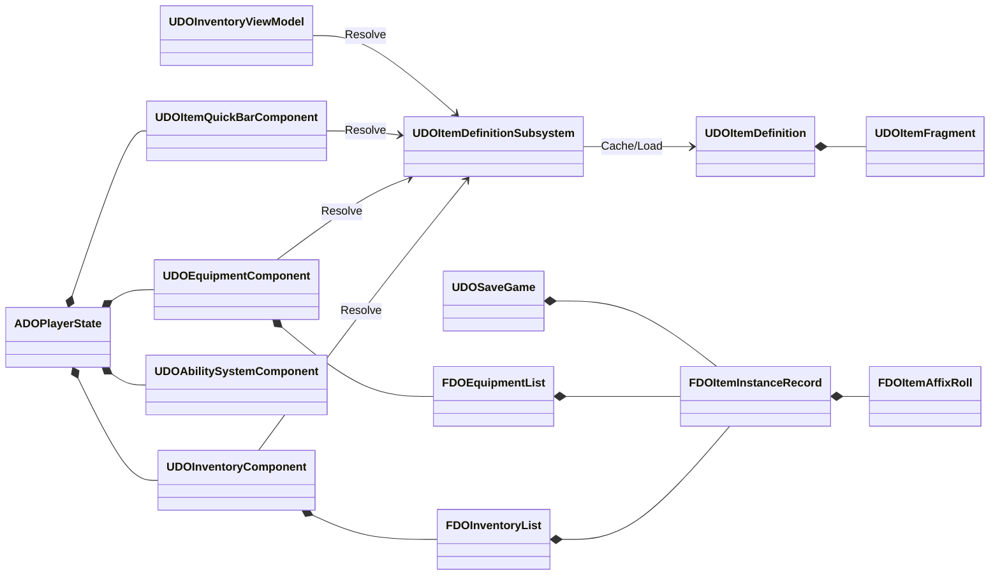

# 物品系统 Phase 1 开发记录

# 1. 系统功能说明

Phase 1 解决的是物品核心数据边界、静态定义解析和持久化可靠性问题，保持现有 Inventory、Equipment、QuickBar、GAS 和 Owner-only 复制模型不变。

本阶段完成的行为：

- `FDOItemInstanceRecord` 与 `FDOItemAffixRoll` 从 Inventory 类型文件迁移到 ItemSystem Core，成为 Inventory、Equipment 和 SaveGame 共用的核心值类型。
- 实例字段和词缀字段增加 `SaveGame` 标记，真实 `SaveGameToMemory/LoadGameFromMemory` 和独立 Slot 往返可以保留实例身份、定义、数量、槽位、强化、耐久和词缀。
- 新增 `UDOItemDefinitionSubsystem`，集中处理 `PrimaryAssetId -> UDOItemDefinition` 的同步解析、缓存和异步加载请求。
- 没有 `GameInstance` 的 transient 测试对象仍可通过 `UAssetManager` fallback 解析，避免测试和工具对象失去定义加载能力。
- QuickBar 恢复只验证 Definition 合法且包含 Consumable Fragment，不再要求当前库存存在该 Definition；“已绑定药水用尽后保存读档”可以成功恢复为零库存绑定。
- Inventory 整理排序加入 `UDOItemDefinition::SortPriority`，原有类型、装备槽、品质和实例稳定键仍保留。
- Tooltip、装备比较和装备测试优先使用 `AttributeModifiers`，旧 `BaseAttributeMagnitudes` 仅在类型化值全零时兼容回退。

本阶段明确没有做的事情：FastArray 事务和 Revision 重构、EquipmentInstance、装备 AbilitySet 授予、公开外观复制和 ViewModel 增量架构。这些属于后续 Phase。

# 2. C++ 架构说明

### 2.1 类关系



### 2.2 核心类型职责

| 类型 | 所在文件 | 职责 |
|---|---|---|
| `FDOItemAffixRoll` | `ItemSystem/Core/DOItemInstanceTypes.h` | 保存某个实例的词缀 Tag 和动态数值；只承载数据，不执行规则。 |
| `FDOItemInstanceRecord` | `ItemSystem/Core/DOItemInstanceTypes.h` | 保存稳定 GUID、PrimaryAssetId、堆叠、槽位、强化、耐久和词缀；可复制、可存档。 |
| `FDOItemDefinition` | `ItemSystem/Core/DOItemDefinition.h` | `UPrimaryDataAsset` 静态定义；保存展示信息、物品类型、品质、堆叠规则、排序优先级和 Instanced Fragment。 |
| `UDOItemFragment_*` | `ItemSystem/Core/DOItemDefinition.h` | 按物品能力拆分配置。Inventory Fragment 定义通用规则，Equipment Fragment 定义槽位和类型化属性，Consumable Fragment 定义使用效果。 |
| `FDOInventoryEntry/List` | `ItemSystem/Inventory/DOInventoryTypes.h` | FastArray 网络容器。Entry 只包装实例记录，List 负责增量序列化和回调聚合。 |
| `UDOInventoryComponent` | `ItemSystem/Inventory/DOInventoryComponent.*` | PlayerState 上的背包聚合根，负责服务器权威添加、堆叠、移动、拆分、消耗、排序和快照。 |
| `UDOEquipmentComponent` | `ItemSystem/Equipment/DOEquipmentComponent.*` | PlayerState 上的装备聚合根，负责槽位校验、Inventory 与 Equipment 之间的穿戴事务，以及现有属性 GE 生命周期。 |
| `UDOItemQuickBarComponent` | `ItemSystem/QuickBar/DOItemQuickBarComponent.*` | 保存 DefinitionId 快捷栏绑定并转发使用请求；不复制 ItemInstance 指针。 |
| `UDOItemDefinitionSubsystem` | `ItemSystem/Core/DOItemDefinitionSubsystem.*` | GameInstance 级只读解析器和缓存；不拥有背包状态、不参与权限判定、不保存实例。 |
| `UDOInventoryViewModel` / `UDOItemQuickBarViewModel` | UI/QuickBar 域 | 将组件快照转换为展示数据，负责筛选、Pending 和消息订阅；不直接修改实例。 |
| `UDOSaveGame` | `SaveGame/DOSaveGame.*` | 保存版本、职业、Inventory/Equipment/QuickBar 快照；不保存 FastArray 内部复制键或 GAS Handle。 |

### 2.3 UObject、ActorComponent、Struct 的边界

- `UPrimaryDataAsset`/`UObject Fragment` 只描述静态规则和资源引用，适合编辑器配置及 Asset Manager 管理。
- `ActorComponent` 是 PlayerState 上的运行时聚合根，拥有动态实例记录、网络入口和服务器校验。
- `USTRUCT` 是可复制、可存档的无副作用数据；`FDOItemInstanceRecord` 不持有 UObject 指针，不在构造/析构时执行 GAS 操作。
- `Actor` 仍只负责世界交互，例如拾取 Actor；拾取成功后由服务器把 DefinitionId 和数量交给 InventoryComponent。

# 3. 蓝图编辑器配置教程

### 3.1 创建 ItemDefinition DataAsset

编辑器步骤：

1. 打开 Content Browser，进入 `/Game/DragonOath/Items/Definitions`。
2. 右键 > Miscellaneous > Data Asset。
3. 选择 `DOItemDefinition`，创建 `DA_Item_HealthPotion_Small`、装备和材料测试资产。
4. 填写 `DisplayName`、`Description`、`Icon`、`ItemType`、`Rarity`、`MaxStackSize`、`SortPriority` 和 `SellPrice`。
5. 在 `Fragments` 添加 `UDOItemFragment_Inventory`；装备再添加 `UDOItemFragment_Equipment`，消耗品再添加 `UDOItemFragment_Consumable`。
6. 装备属性写入 `Equipment > AttributeModifiers`。不要为新资产填写 `Equipment|Legacy > BaseAttributeMagnitudes`。
7. 点击 Save，再执行 Asset Actions > Validate。

装备 Fragment 的关键配置：

| 字段 | 作用 | 示例 |
|---|---|---|
| `EquipmentSlotTag` | 决定装备槽 | `Equipment.Slot.Weapon` |
| `RequiredLevel` | 服务器穿戴等级校验 | `10` |
| `RequiredProfessionQuery` | 职业限制 | 匹配 `Profession.*` |
| `AttributeModifiers` | 参与装备属性 GE 的类型化输入 | `AttackPower=25`、`DefensePower=8` |
| `MaxDurability` | 实例耐久上限 | `100` |

消耗品 Fragment 的关键配置：

- 普通回复选择 `EffectKind = InstantRestore` 并填写 `InstantRestore`。
- 限时 Buff 选择 `TimedAttributeModifier` 并填写持续时间、属性和 GrantedTags。
- 有动画、目标选择或异步流程时选择 `GameplayAbility`，引用一个继承 `UDOGameplayAbility` 的 GA。
- 事件驱动道具选择 `GameplayEvent`，填写集中声明的 Event Tag。

### 3.2 Asset Manager

Project Settings > Asset Manager 中确认 ItemDefinition 类型扫描 `/Game/DragonOath/Items/Definitions`。运行时只保存 `FPrimaryAssetId`；Subsystem 会从 Asset Manager 获取路径并缓存对象。不要在蓝图中保存硬引用的 ItemDefinition UObject 作为实例状态。

### 3.3 GameplayTag

本阶段不新增 Tag。使用现有集中声明：

- `Item.Type.*`、`Item.Rarity.*`
- `Equipment.Slot.*`
- `Data.Equipment.*`
- `Cooldown.*` 和 `Event.*`

如果业务需要新 Tag，先在 `DOGameplayTag.h/.cpp` 声明并添加中文注释，再在 DataAsset 或 GA 下拉框中选择。不要在蓝图节点中写 `RequestGameplayTag` 字符串。

### 3.4 GameplayAbility

Phase 1 不新增装备授予 Ability。只有 Consumable 配置为 `GameplayAbility` 时才需要：

1. 在 Content Browser 右键创建 Gameplay Ability Blueprint。
2. 父类选择 `DOGameplayAbility` 或项目已有的道具 Ability 基类。
3. 设置 `Instancing Policy = Instanced Per Actor`，输入策略按现有 Ability 规范配置。
4. Ability 只负责表现、目标选择和复杂流程；最终消耗必须回到服务器 `CommitConsumableUse`，蓝图不得直接修改 Inventory 数量。
5. Cost、Cooldown 和状态标签使用现有 GAS/GameplayTag 体系，不能在 Widget 中手动施加装备属性。

### 3.5 Actor / Component 挂载

`ADOPlayerState` 已创建并拥有 `UDOInventoryComponent`、`UDOEquipmentComponent`、`UDOItemQuickBarComponent` 和玩家 ASC。不要在 `BP_BasePlayerState` 或 Character Blueprint 中重复添加同名组件。

`UDOInventoryScreen`、`UDOInventoryViewModel` 和 QuickBar ViewModel 由现有 UI Policy/页面生命周期创建。它们通过 PlayerState 查找组件并读取快照，不直接持有服务器权威数组。

### 3.6 编辑器检查顺序

```text
打开项目
  -> 打开 Asset Manager，确认 ItemDefinition 扫描路径
  -> 打开一个 DA_Item_*，迁移 AttributeModifiers 并 Validate
  -> 检查 GameplayTags 是否来自 DOGameplayTag 集中声明
  -> 打开 Inventory Screen，确认 Tooltip 显示类型化属性
  -> PIE Listen Server + 1 Client，测试消耗、QuickBar 和存档
```

# 4. 测试流程

### 4.1 单机 / 自动化测试

覆盖重点：

- 添加、堆叠、容量、拆分、移动和整理；验证 `SortPriority`。
- Equip 属性测试使用 `AttributeModifiers`，确认实际 GE 与 Tooltip 数值一致。
- `SaveGameToMemory -> LoadGameFromMemory` 逐字段验证实例与词缀。
- 独立 SaveGame Slot 往返验证 InstanceId，并在测试后删除隔离槽位。
- 绑定消耗品、用尽库存、内存存档、重建 SaveGame 对象并恢复，确认 QuickBar 保留零库存 DefinitionId。

编辑器中可在 Session Frontend > Automation 运行 `DragonOath.Inventory`、`DragonOath.Equipment` 测试组。命令行执行时使用项目现有的 `UnrealEditor-Cmd.exe` 和 `-ExecCmds="Automation RunTests DragonOath.Inventory; Quit"`，并使用隔离的 Saved 目录。

### 4.2 网络测试

1. Play 设置为 `Listen Server`，Players 设置为 `2`。
2. 在服务器端添加、移动、使用和装备物品。
3. 确认只有 Owner Client 收到完整背包、装备实例和 QuickBar 数据，另一客户端看不到词缀、耐久和私有 InstanceId。
4. 在延迟条件下验证服务器才扣数量，客户端只显示 Pending，复制到达后 ViewModel 与服务器快照一致。
5. 断线重连后验证 SaveGame 恢复不会因零库存 QuickBar 绑定失败。

Phase 1 没有改变 FastArray 回调协议，因此真实 Add/Change/Remove 聚合、Revision 和 RPC 回执仍由 Phase 2 验证。

### 4.3 GAS 测试

- 装备一件只配置 `AttributeModifiers` 的装备，观察 PlayerState ASC 的 Combat Attribute 是否通过现有原生 Infinite GE 增加。
- 卸下装备，确认对应 Effect Handle 被移除且职业 Ability 不受影响。
- 配置一个 InstantRestore 消耗品，确认效果由服务器 ASC 应用，数量只在提交成功后减少。
- 配置 GameplayAbility 类型消耗品，确认 GA 不直接修改库存，最终通过服务器提交接口扣除。

# 5. 常见错误

| 现象 | 原因 | 处理 |
|---|---|---|
| Definition 找不到 | Asset Manager 未扫描目录，或保存的 PrimaryAssetType 不一致 | 检查 `/Game/DragonOath/Items/Definitions`、Asset Manager 和资产重命名后的 PrimaryAssetId。 |
| Tooltip 没有属性 | 新资产只配置了错误字段或 Fragment 类型不对 | 使用 `UDOItemFragment_Equipment` 的 `AttributeModifiers`，执行 Data Validation。 |
| 存档加载后实例字段为默认值 | 使用旧二进制或字段未带 `SaveGame` | 重新编译并使用新 SaveGame 对象；确认实例和 Affix 字段都带 `SaveGame`。 |
| 零库存快捷栏导致整份存档失败 | 仍使用旧恢复逻辑要求库存存在 | 确认运行的是 Phase 1 `RestoreQuickBarSnapshot`，并只绑定 Consumable Definition。 |
| 消耗品使用没有扣数量 | GA 未调用服务器提交接口，或 ASC ActorInfo 未初始化 | 检查 `CommitConsumableUse` 和 PlayerState ASC 初始化顺序。 |
| 装备属性在 UI 与角色不同 | UI 使用 Legacy Map，运行时使用 Typed 字段 | 迁移资产到 `AttributeModifiers`，不要在 Widget 手动累加最终属性。 |
| 修改后 UHT 报重复类型 | 旧头文件仍定义 `FDOItemInstanceRecord` | 删除旧定义并包含 `ItemSystem/Core/DOItemInstanceTypes.h`，不要复制结构体。 |
| 编辑器编译被 VRM4U 阻断 | 当前工程插件存在 Unity 编译时静态符号重定义 | 这是工程既有插件问题；本阶段 DragonOath 模块已完成编译，单独处理插件构建配置。 |

## 6. 验证结论

`DragonOath` 模块中的 Phase 1 新增和修改源文件已进入编译动作并通过自身 C++ 编译。命令行自动化测试已通过：`DragonOath.Inventory`（包含 Archive 往返、零库存 QuickBar、堆叠/移动/消耗）和 `DragonOath.Equipment`（事务、存档恢复、快照校验）。完整 `DragonOathEditor` 构建仍被 `Plugins/VRM4U` 的既有 `VrmConvertModel.cpp` / `VrmConvertModel_Description.cpp` Unity 静态符号重定义阻断；该插件按项目决定等待官方更新，本阶段未修改它，也未修改用户已有的 Content、Target 或构建日志变更。
