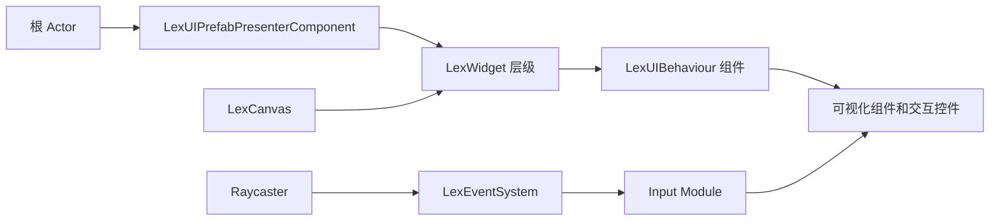

# LGUI（LexUI）使用指南

## 1. 文档说明

本文档说明 DragonOath 项目中 `Plugins/LGUI` 插件的使用方式。

这个插件在清单中的正式名称是 `LexUI`，但目录名、模块名和 Unreal 资产路径都使用 `LGUI`。

当前本地插件信息：

- 插件版本：`4.0.pre1`
- 插件清单声明的引擎版本：`5.8.1`
- 项目引擎关联版本：`5.8`
- 插件目录：`D:\ue_texiao\DragonOath\Plugins\LGUI`
- 官方文档：[LGUIDoc](https://liufei2008.github.io/LGUIDoc/)

项目已经在 `DragonOath.uproject` 中启用 LGUI。插件目录下的 `Binaries/` 和 `Intermediate/` 是构建产物，不要手动修改，也不要提交到 Git。

## 2. LGUI 是什么

LGUI 是一套基于自定义 `UObject` 层级结构的 UI 框架，不等同于普通的 UMG `UUserWidget`。

它主要提供：

- 屏幕空间 UI 和 3D 世界空间 UI。
- 带锚点、尺寸、Pivot、裁剪、透明度和层级顺序的 `LexWidget` 层级。
- `LexText`、`LexImage`、`LexSprite`、`LexRectBlock` 等可视化组件。
- Button、Toggle、Slider、ScrollView、Dropdown、TextInput 等交互控件。
- 支持嵌套、变体和实例覆盖的 Prefab 资源。
- 自定义 Raycast 和输入事件分发。
- `LTween` 补间动画，以及面向设计师的 `LexUIPlayTweenComponent`。

运行时关系如下：



可以这样理解：

- `ULexWidget`：UI 层级节点，可以理解为“RectTransform + GameObject”的组合。
- `ULexUIBehaviour`：挂在 `ULexWidget` 上的组件基类。
- `ULexCanvas`：控制渲染模式、排序、缩放和渲染目标。
- `ULexUIPrefab`：保存一套可复用的 UI 层级。
- `ULexUIPrefabPresenterComponent`：把 Prefab 加载到 Actor 上。
- Raycaster：根据鼠标、触摸或射线找到目标 Widget。
- `LexEventSystem`：把输入事件分发给目标 Widget 上的交互组件。

## 3. 插件模块和项目接入

LGUI 插件包含四个模块：

| 模块 | 类型 | 作用 |
|---|---|---|
| `LGUI` | Runtime | LexUI Widget、Canvas、渲染、控件和事件系统 |
| `LGUIEditor` | Editor | Prefab 编辑器、详情面板、资产操作和编辑器工具 |
| `LGUIK2Nodes` | UncookedOnly | LGUI 使用的蓝图节点 |
| `LTween` | Runtime | LGUI 使用的补间动画模块 |

项目的 `.uproject` 已经启用：

```json
{
    "Name": "LGUI",
    "Enabled": true
}
```

如果 DragonOath 的 C++ 代码需要包含 LGUI 头文件或调用 LGUI 类，需要修改 `Source/DragonOath/DragonOath.Build.cs`：

```csharp
PublicDependencyModuleNames.AddRange(new string[] {
    // 其他已有模块...
    "UMG", "Slate", "SlateCore",
    "LGUI", "LTween"
});
```

修改 `Build.cs` 后，必要时重新生成项目文件，然后重新编译编辑器。LGUI 源码使用 C++20，当前本地版本针对 Unreal Engine 5.8.x 构建；以后升级引擎小版本时，需要重新验证插件编译和 Prefab 兼容性。

## 4. 推荐的资产目录

项目自己的 LGUI 资产建议放在项目 Content 目录中，不要直接修改插件自带资产：

```text
Content/
  UI/
    LGUI/
      Prefabs/
      Materials/
      Textures/
      Fonts/
      Animations/
```

插件资产在 Content Browser 中使用 `/LGUI/` 虚拟路径。常用位置包括：

- `/LGUI/Blueprints/`
- `/LGUI/Prefabs/`
- `/LGUI/EnhancedInput/`
- `/LGUI/Materials/`
- `/LGUI/DefaultFont_Bitmap`
- `/LGUI/DefaultFont_DistanceField`

插件源码中的对应目录是 `Plugins/LGUI/Content/`。插件自带的 Button、Toggle 等 Prefab 只能作为参考或模板使用。项目需要定制时，复制到项目 Content 目录，避免插件更新覆盖修改。

## 5. 创建第一个屏幕空间 UI

### 5.1 创建 LGUI Prefab

1. 在 Content Browser 中创建 `LexUI Prefab` 资产。它通常位于高级资产分类 `LexUI` 下，直接搜索 `LexUI Prefab` 最方便。
2. 双击打开 Prefab，进入 LexUI Prefab Editor。
3. 在层级面板中选择根 Widget 或根 Agent。
4. 打开 LGUI Widget 操作菜单，使用 `Create UI Element` 添加 `Widget`、`Text`、`Image` 或 `RectBlock`。
5. 使用控件菜单添加 `Button`、`Toggle`、`Slider`、`ScrollView`、`Dropdown` 或 `TextInput`。
6. 给需要运行时查找的节点设置稳定名称，例如 `Title`、`ConfirmButton`、`InventoryList`。
7. 保存 Prefab。

选中 Widget 后，编辑器还提供这些操作：

- `Create Prefab`
- `Open Prefab asset`
- `Browse to Prefab asset`
- `Unpack this Prefab`
- `Prefab Override Properties`

从已有层级创建 Prefab 时，资产必须保存到项目 `Content` 目录内。

### 5.2 放置屏幕空间根 Actor

HUD、主菜单和固定在屏幕上的 UI，使用插件自带的根蓝图：

```text
/LGUI/Blueprints/LexScreenSpaceRoot
```

这个模板包含：

- `LexCanvas`
- `LexUIPrefabPresenterComponent`
- `LexScreenSpaceRaycaster`

选中根 Actor 上的 `LexUIPrefabPresenterComponent`，把项目自己的 `LexUI Prefab` 赋给 `WidgetPrefab`。

为了让鼠标、触摸和导航输入生效，还需要在关卡中放置：

```text
/LGUI/Blueprints/LexEventSystemActor_EnhancedInput
```

这个 Actor 提供 `LexEventSystem` 和输入模块。

### 5.3 配置 Canvas 缩放

选中根 Actor 上的 `LexCanvas`。普通 HUD 建议配置为：

- Render Mode：`ScreenSpaceOverlay`
- Scale Mode：`ScaleWithScreenSize`
- Reference Resolution：项目 UI 设计分辨率，例如 `1920 x 1080`
- Screen Match Mode：通常使用 `MatchWidthOrHeight`
- Match：根据 UI 设计选择优先匹配宽度或高度

LGUI 的 `FLexUIAnchorData` 包含五个核心字段：

| 字段 | 含义 |
|---|---|
| `Pivot` | Widget 的局部原点，范围通常为 0 到 1 |
| `AnchorMin` | 相对于父节点的左下锚点 |
| `AnchorMax` | 相对于父节点的右上锚点 |
| `AnchoredPosition` | 相对锚点参考位置的偏移 |
| `SizeDelta` | Widget 在非拉伸状态下的尺寸 |

常用布局示例：

```text
居中面板：
  Pivot = (0.5, 0.5)
  AnchorMin = (0.5, 0.5)
  AnchorMax = (0.5, 0.5)
  AnchoredPosition = (0, 0)
  SizeDelta = (600, 400)

全屏背景：
  AnchorMin = (0, 0)
  AnchorMax = (1, 1)
  SizeDelta = (0, 0)

右上角按钮：
  Pivot = (1, 1)
  AnchorMin = (1, 1)
  AnchorMax = (1, 1)
  AnchoredPosition = (-24, -24)
```

优先使用编辑器里的 Anchor 工具进行布局。运行时调整布局时，应使用 `SetAnchorData`、`SetSize`、`SetAnchoredPosition` 等函数，不要同时混用局部 Transform 和 AnchorData。

## 6. 可视化组件

### 6.1 LexText

`LexText` 用于显示 LGUI 层级中的文字。

常用属性包括：

- Font 资产。
- `Text`。
- `FontSize`。
- 水平和垂直对齐。
- 溢出和换行策略。
- Rich Text 开关。
- Rich Text 的样式数据和图片数据。

插件自带 Bitmap Font 和 Distance Field Font。通常建议使用 Distance Field Font，以便文字在不同尺寸下保持清晰；只有需要特殊点阵风格时才使用 Bitmap Font。

插件支持类似下面的富文本标签：

```text
<size=48>大号文字</size>
<color=#00ff00>绿色文字</color>

```

使用自定义标签或内嵌图片时，需要打开 Rich Text，并配置对应的样式数据或图片数据。

### 6.2 LexImage 和 Sprite

`LexImage` 可以渲染 Texture、Material 或 LGUI Sprite。源码提供了这些运行时函数：

- `SetBrush_Texture`
- `SetBrush_Material`
- `SetBrush_LexUISprite`
- `SetBrush_SlateSprite`
- `SetBrushTintColor`

需要九宫格、填充、平铺或特殊裁切时，应从 Texture 创建 LexUI Sprite Data，再把 Sprite 赋给 Image。Content Browser 针对 Texture 提供了 `LexUISprite` 操作菜单。

`LexSprite` 支持普通、九宫格、平铺和填充模式，适合血条、冷却遮罩、面板边框等不能简单拉伸的 UI。

### 6.3 RectBlock 和 Material

`LexRectBlock` 适合制作面板、纯色背景和简单矩形 UI。

需要渐变、遮罩、特殊边缘、噪声或其他自定义效果时，再使用 Material。插件还提供背景模糊和像素化等后处理元素，这些效果要控制数量，特别是世界空间 UI 中可能增加渲染成本。

## 7. Button、事件和输入

### 7.1 优先使用现成控件

插件在 `/LGUI/Prefabs/` 下提供了可复用控件：

- `Button`
- `Toggle`、`ToggleGroup`
- `HorizontalSlider`、`VerticalSlider`
- `HorizontalScrollbar`、`VerticalScrollbar`
- `Dropdown`
- `TextInput`、`TextInput_Multiline`
- `HorizontalScrollView`、`VerticalScrollView`

一个控件通常由一个 `ULexWidget` 和多个 `ULexUIBehaviour` 组成。除非确实需要完全不同的行为，否则不要从空 Widget 手动重做 Button。

### 7.2 Button 点击

蓝图中，选中 Widget 上的 `UIButton` 组件，绑定它的 `OnClick` 事件即可。

需要监听通用鼠标或触摸事件时，可以添加 `UIEventTrigger`，它支持：

- `OnPointerEnter`
- `OnPointerExit`
- `OnPointerDown`
- `OnPointerUp`
- `OnPointerClick`
- `OnPointerBeginDrag`
- `OnPointerDrag`
- `OnPointerEndDrag`
- `OnPointerScroll`
- `OnSelect`
- `OnDeselect`

模态窗口的遮罩层可以添加 `UIEventBlocker`，阻止点击穿透到后面的 UI。LGUI 的事件默认可以沿 Widget 父子层级向上冒泡；需要阻止冒泡时，应检查事件处理组件或使用 `UIEventBlocker`。

### 7.3 Pointer 和导航输入

输入链路如下：

```text
鼠标 / 触摸 / 手柄
  -> Input Module
  -> LexEventSystem
  -> Raycaster
  -> LexWidget 和 LexUIBehaviour 接口
```

插件提供的 `LexEventSystemActor_EnhancedInput` 使用以下 Enhanced Input 资产：

- `IMC_LexUIInputContext`
- `IA_MouseWheel`
- `IA_Trigger`
- `IA_TriggerMiddle`
- `IA_TriggerRight`

DragonOath 已经有自己的 Enhanced Input 和 CommonUI 系统。接入时不要让两套独立的 UI 输入系统同时接管同一个本地玩家，否则可能出现重复导航、焦点跳转或点击被错误消费的问题。

手柄导航需要配置 `UISelectable`。它支持自动方向搜索，也支持显式指定：

- `Left`
- `Right`
- `Up`
- `Down`
- `Next`
- `Prev`

复杂菜单、动态背包网格和分页列表建议使用显式导航引用。

多人游戏中，`LexEventSystem` 通过 `UserIndex` 区分本地用户。UI 应当是客户端本地对象，不要把可视化 Widget 当成服务器权威的游戏状态进行复制。

## 8. 世界空间 UI

根据渲染需求选择一个根模板：

| 蓝图 | Canvas 渲染模式 | 适用场景 |
|---|---|---|
| `LexWorldSpaceRoot_LexRenderer` | `WorldSpace - LexUI Renderer` | 不希望受到 UE 后处理影响的世界 UI |
| `LexWorldSpaceRoot_UERenderer` | `WorldSpace - UE Renderer` | 希望使用 UE 默认渲染管线的世界 UI |

世界空间交互还需要射线来源。插件提供：

```text
/LGUI/Blueprints/LexWorldSpaceRaycasterSource_Mouse
```

根 Canvas 上有 `TraceChannel` 属性。出现“看得见但点不到”时，依次检查：

- 射线来源 Actor 是否存在并处于启用状态。
- 根 Actor 是否朝向摄像机。
- `TraceChannel` 是否与射线设置一致。
- Widget 和 Visual 是否允许 Raycast。
- 是否有 `UIEventBlocker` 或禁用的父节点截断事件。

`WorldSpace - LexUI Renderer` 适合不希望世界后处理影响 UI 的情况；`WorldSpace - UE Renderer` 适合希望 UI 像普通场景几何体一样参与 UE 渲染效果的情况。

## 9. Prefab 生命周期和运行时代码

`LexUIBehaviour` 的常见生命周期为：

```text
Awake -> OnEnable -> Start -> Tick
                       \-> OnDisable -> OnDestroy
```

说明：

- `Awake`：Widget 创建或 Prefab 加载后调用。
- `OnEnable`：Widget 在层级中启用时调用。
- `Start`：第一次 Tick 前调用。
- `Tick`：每帧调用。
- `OnDisable`：Widget 禁用时调用。
- `OnDestroy`：Widget 销毁时调用。

需要尽早建立的引用放在 `Awake`；依赖同级或子级 Widget 已经准备完成的初始化，放在 `Start` 更稳妥。

C++ 中可以通过 Presenter 获取加载后的根 Widget：

```cpp
#include "Core/Components/LexText.h"
#include "Core/Components/LexWidget.h"
#include "Interaction/UIButton.h"
#include "PrefabSystem/LexUIPrefabPresenterComponent.h"

void ADOExampleUIActor::InitializeLGUI()
{
    ULexUIPrefabPresenterComponent* Presenter =
        FindComponentByClass<ULexUIPrefabPresenterComponent>();

    if (!Presenter)
    {
        return;
    }

    ULexWidget* RootWidget = Presenter->GetLoadedWidget();
    if (!RootWidget)
    {
        // Presenter 尚未完成加载时，可以延迟一帧，或从 LexUIBehaviour::Start 初始化。
        return;
    }

    if (ULexWidget* TitleWidget = RootWidget->FindChildByDisplayName(TEXT("Title"), true))
    {
        if (ULexText* Title = TitleWidget->GetComponent<ULexText>())
        {
            Title->SetText(FText::FromString(TEXT("DragonOath")));
        }
    }

    if (ULexWidget* ConfirmWidget = RootWidget->FindChildByDisplayName(TEXT("ConfirmButton"), true))
    {
        if (UUIButton* ConfirmButton = ConfirmWidget->GetComponent<UUIButton>())
        {
            ConfirmButton->GetOnClickEvent().AddUObject(
                this, &ThisClass::HandleConfirmClicked);
        }
    }
}
```

运行时查找建议使用稳定的 DisplayName 或路径，例如 `Panel/ConfirmButton`。LGUI 提供：

- `FindChildByDisplayName`
- `FindChildArrayByDisplayName`

不要依赖自动生成的 UObject 名称。

如果需要手动加载 Prefab，`ULexUIPrefab` 提供：

- `LoadPrefab`
- `LoadPrefabWithTransform`
- 支持资产和 Class 替换表的加载函数

关卡中由 Actor 持有的 UI，优先使用 `LexUIPrefabPresenterComponent`，因为它会同时处理 Prefab、Canvas 和宿主 Actor 的关系。

## 10. 动画

`LTween` 模块在 Widget 和 Visual 上提供了 Blueprint/C++ 补间函数，常用函数包括：

- `AnchoredPositionTo`
- `SizeDeltaTo`
- `RenderOpacityTo`
- `ColorTo`
- `LocalPositionTo`
- `LocalScaleTo`
- `LocalRotatorTo`

设计师配置的动画可以添加 `LexUIPlayTweenComponent`，设置 `PlayTween`，再调用 `Play` 或 `Stop`。`bPlayOnStart` 控制是否自动播放。

如果动画表现的是技能、伤害、死亡或其他游戏状态，权威状态必须保存在 C++、GAS 或服务器同步的数据中，LGUI 只负责表现，不要把 UI 动画当成游戏逻辑真相。

## 11. DragonOath 中的职责边界

DragonOath 同时启用了 CommonUI、Enhanced Input 和 LGUI。建议按下面的边界使用：

| 职责 | 建议负责者 |
|---|---|
| 页面栈、模态策略和高层输入焦点 | CommonUI / 项目 UI Policy |
| 可复用的 2D/3D 可视化层级和 Prefab | LGUI |
| LGUI 内部的 Button、Slider、ScrollView 交互 | LGUI EventSystem |
| 游戏状态、网络权威和服务器决定 | C++ / GAS / 复制系统 |
| 文字、图标和数值显示 | 由游戏状态驱动的 UI Controller/ViewModel |

这部分是 DragonOath 的接入建议，不是 LGUI 的硬性限制。一个页面应当明确由一套系统负责焦点和输入。不要在同一个页面上同时让 CommonUI 输入策略和独立的 LGUI 输入 Actor 抢焦点。

第一次做 DragonOath UI 原型时，可以选择以下两种模式之一：

1. CommonUI 页面负责导航和页面管理，LGUI 负责独立的可视化区域。
2. 专用 LGUI 根 Actor 负责完整的 HUD 或 3D 面板，该页面不再让 CommonUI 接管同一条输入链路。

插件的 `LexUMGWidget` 是反向适配：它是把 UMG Widget 渲染成 LGUI 元素，不要把它误认为通用的 LGUI 转 CommonUI 桥接器。

## 12. 常见问题

| 现象 | 优先检查 |
|---|---|
| 找不到 `LexUI Prefab` 资产 | 插件是否启用、编辑器是否重启、`LGUIEditor` 是否加载、项目文件是否刷新 |
| C++ 找不到 LGUI 类 | `DragonOath.Build.cs` 是否加入 `LGUI` 和 `LTween`，然后重新编译 |
| UI 不显示 | 根 Actor、`WidgetPrefab`、WidgetActive、Canvas 渲染模式、DefaultMaterial 和 Font |
| 文字为空或乱码 | `LexText` 是否设置 Font，字体资产是否会被打包进最终构建 |
| Button 没有点击反应 | EventSystem Actor、Input Module、Raycaster、`RaycastTarget`、Interactable 和 UserIndex |
| 世界空间 UI 点不到 | Raycaster Source、`TraceChannel`、碰撞/射线设置和摄像机朝向 |
| 点击穿透到父节点或后面的 UI | `UIEventBlocker`、事件冒泡和事件处理函数返回值 |
| Prefab 修改后实例不更新 | 是否保存/应用源 Prefab，是否刷新实例，是否出现版本警告 |
| 升级引擎或插件后 Prefab 报错 | 用当前版本打开并保存；不兼容时按提示重建 Prefab |
| UI 闪烁或被其他 Canvas 遮挡 | 根 Canvas 的 `bOverrideSorting`、`SortOrder` 和根层级顺序 |

## 13. 第一个测试关卡验收清单

正式使用 LGUI 前，建议先建立一个小型测试关卡，确认：

- 屏幕空间根 Actor 能显示项目自己的 Prefab。
- 运行时可以修改 `LexText` 文本。
- `UIButton` 点击事件能够正确触发，且不会触发多次。
- 模态遮罩能够阻止后面的 UI 被点击。
- 如果需要手柄导航，两个控件之间可以正确切换焦点。
- 世界空间根 Actor 能显示，并能通过鼠标射线点击。
- 打包后的 Development 构建也能正常工作，而不只是编辑器 PIE 正常。
- UI Actor 中没有保存服务器权威状态，也没有把 UI 可视化对象当成复制数据。

